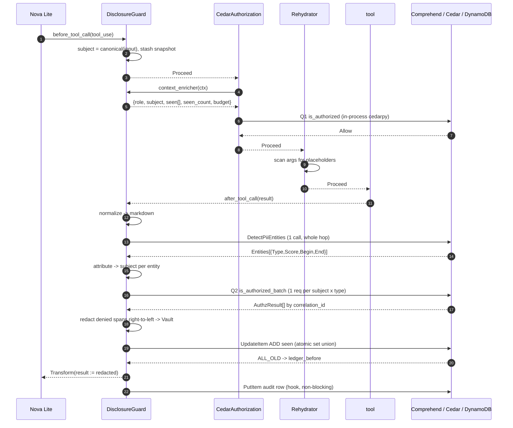
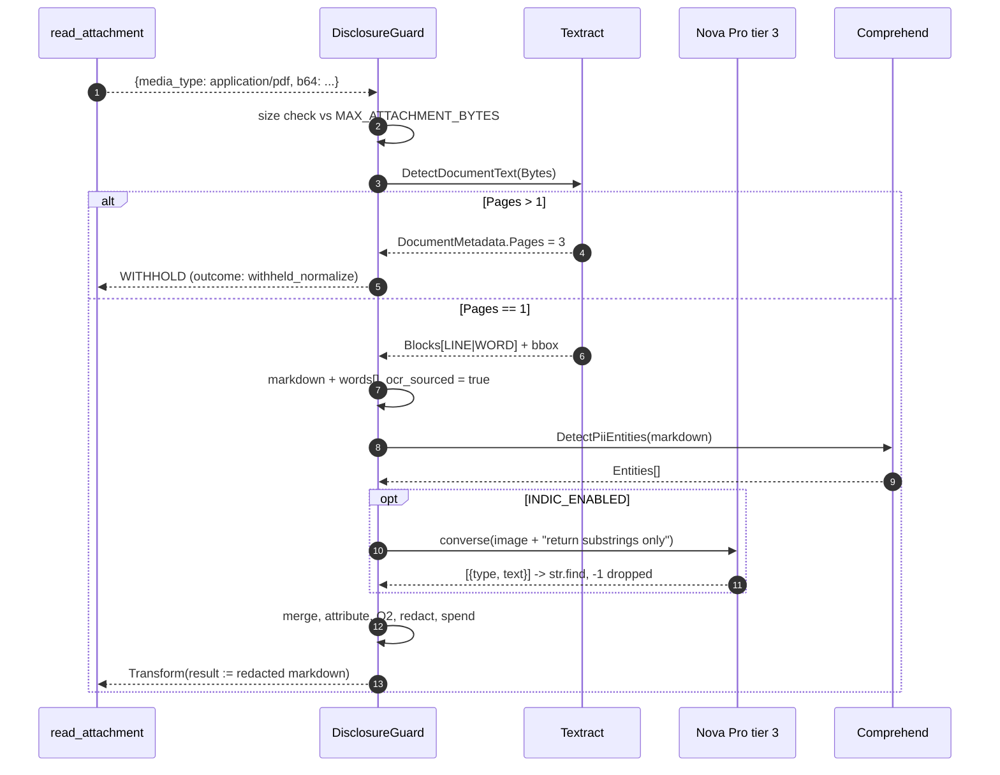

# Naka — Technical Design

**Document:** 08 of the Naka planning package · **Written:** 18 September 2026
**Implements:** `hackathon-agent-egress-guardrail-prd-2026-09-18.md` (PRD v2)
**Status:** buildable. Every decision below is made; nothing is left to the implementer except the things explicitly marked *verify at runtime*.

The PRD says what and why. This says how. Where the PRD sketched a shape and the shape does not survive contact with the requirements, §0 says so out loud rather than quietly re-drawing it.

---

## 0. Deviations from the PRD, and the one correction

Four deliberate departures. Each is a design sketch in the PRD, not one of its verified external facts.

| # | PRD says | This design does | Why |
|---|---|---|---|
| D1 | Audit table `pk = invocation_id`, `sk = seq#<n>` (§10) | `pk = SESSION#<session_id>`, `sk = CALL#<ts>#<seq>` | A session spans several Lambda invocations — that is Must #5. With `pk = invocation_id` the dashboard's primary view (one session, all its calls, its meters) needs a scan or a second GSI. `invocation_id` survives as an attribute. |
| D2 | Control plane exposes `POST /decisions → DynamoDB audit` (§5) | The data plane writes DynamoDB directly from `AuditHook` | An HTTP hop to write a row both Lambdas can already write adds ~40 ms and a whole failure mode for nothing. Rejected alternative: keep the hop for a future cross-account split — not this weekend. |
| D3 | Ledger lives in `agent.state`, persisted by `S3SessionManager` (§5) | Ledger is **authoritative in DynamoDB**, **cached in `agent.state`** via `S3SessionManager` | `S3SessionManager` takes no lock (verified below) so it can lose an update. A DynamoDB `ADD` to a String Set is an atomic set-union and cannot. Must #5 is still satisfied and still demoed — the state copy is real and does survive restore. §6 has the full argument. |
| D4 | Ledger handler runs before Cedar, then again for rehydration (§5) | Three interventions: `DisclosureGuard`, `CedarAuthorization`, `Rehydrator` | One handler's `before_tool_call` runs once. Rehydration must happen *after* Cedar allows, so it is a separate 15-line handler registered third. A `Deny` from Cedar skips it, which is exactly the behaviour wanted: a denied call never gets plaintext substituted into its arguments. |

**One correction to flag, not work around.** PRD §8 states Comprehend does "English and Spanish only", and §7 pins `LanguageCode="en"`. The `DetectPiiEntities` API reference contradicts itself on this page: the prose says "Enter the language code for English (en) or Spanish (es)", but the **Valid Values** enum on the same page reads `en | es | fr | de | it | pt | ar | hi | ja | ko | zh | zh-TW` — including `hi`. That enum is probably the shared Comprehend `LanguageCode` type rather than a PII-specific list, and `hi` would likely return `UnsupportedLanguageException`. **Settle it with one API call in the first hour.** It changes little either way: Tier 3 exists because Textract will not OCR Devanagari at all, so on a scanned card there is no Indic *text* to hand Comprehend. A working `hi` would only help text-layer Indic content, which is not the demo. Do not rewrite the plan on it; do record the answer.

---

## 1. Module breakdown

One deployment package, two Lambda entry points, flat modules. No packages-within-packages, no dependency-injection container, no base classes with one implementation.

```
naka/
  app_agent.py      data-plane Function URL handler + agent assembly
  app_control.py    control-plane Function URL handler + static UI serving
  guard.py          DisclosureGuard  (intervention: before + after)
  rehydrate.py      Rehydrator (intervention) + Vault
  ledger.py         Ledger (grow-only set) + DynamoDB meter persistence
  normalize.py      bytes -> markdown
  detect.py         tier 1/2/3 + overlap merge + Verhoeff/PAN
  attribute.py      entity -> data subject
  cedar_q2.py       cedarpy is_authorized_batch wrapper
  policy.py         bundle fetch, ETag cache, policy floor
  audit.py          AuditHook + AuditRow + DynamoDB writes
  tools.py          the three demo tools
  config.py         every tunable, one place
  agent.cedar       fallback policy, baked into the zip
  selfcheck.py      the assertion checks from §9
  web/              index.html, api.js, store.js, render.js
```

### 1.0 Shared types

Declared in `detect.py` and `normalize.py`; imported everywhere. Note what is *absent*.

```python
@dataclass(frozen=True, slots=True)
class Entity:
    type: str            # "IN_AADHAAR" | "IN_PERMANENT_ACCOUNT_NUMBER" | "NAME" | "PHONE" | ...
    begin: int           # char offset into the normalized markdown
    end: int             # exclusive
    score: float         # 0.0–1.0
    tier: Literal["checksum", "comprehend", "indic"]
    ocr_derived: bool = False   # checksum failed but shape matched, on OCR text

# Entity has NO `value` field, deliberately. The plaintext is obtained by
# slicing the source text at redaction time and lives in exactly two places:
# a local in redact(), and the Vault. Nothing that could reach a log or a
# DynamoDB row is ever holding a value.

@dataclass(frozen=True, slots=True)
class Word:
    text: str
    bbox: tuple[float, float, float, float]   # Left, Top, Width, Height — Textract normalised 0–1
    begin: int                                 # offset of this word in the assembled markdown

@dataclass(frozen=True, slots=True)
class Normalized:
    markdown: str
    source_media_type: str            # "text/plain" | "application/pdf" | "image/png" | ...
    pages: int
    words: list[Word] | None          # populated only on the Textract path, for bbox overlay
    truncated: bool                   # hit MAX_NORMALIZED_CHARS
    ocr_sourced: bool                 # drives the Verhoeff-as-signal rule in tier 1
```

### 1.1 `ledger.py` — the ledger

The ledger is a **grow-only set (G-Set) per `(session_id, subject_id)`**. It only ever gains entity *types*. Merge is set union. That single property removes locking, ordering and conflict resolution from the entire system (§6).

```python
SubjectId = str
EntityType = str

@dataclass
class Ledger:
    session_id: str
    subjects: dict[SubjectId, set[EntityType]]
    budget: int                       # per subject, from the policy bundle
    session_ceiling: int              # across all subjects, backstop against subject-id churn

    def seen(self, subject: SubjectId) -> list[str]       # sorted list — Cedar needs a list, not a set
    def count(self, subject: SubjectId) -> int
    def total(self) -> int                                 # sum over subjects, for session_ceiling
    def merge(self, other: "Ledger") -> None               # union; monotone; commutative; idempotent
    def add(self, subject: SubjectId, types: Iterable[EntityType]) -> None
    def to_state(self) -> dict                             # JSON-safe, for agent.state
    @classmethod
    def from_state(cls, d: dict | None, *, session_id: str, budget: int, ceiling: int) -> "Ledger"

def load(session_id: str, *, cfg: Config) -> Ledger
    """Query pk=SESSION#<id>, sk begins_with 'METER#', ConsistentRead=True.
       Raises LedgerUnavailable on any failure — the caller MUST fail closed."""

def spend(session_id: str, subject: SubjectId, types: set[EntityType], *, cfg: Config
          ) -> tuple[list[str], list[str]]:
    """Atomic set-union on the meter row. Returns (before, after).
       UpdateItem(Key={pk: SESSION#<id>, sk: METER#<subject>},
                  UpdateExpression='ADD seen :t SET budget=:b, last_ts=:ts, expires_at=:e',
                  ExpressionAttributeValues={':t': {'SS': sorted(types)}, ...},
                  ReturnValues='ALL_OLD')
       after = before | types, computed locally. One round trip, no read-modify-write,
       no lost update. Never call with an empty `types`: DynamoDB rejects empty sets."""

class LedgerUnavailable(Exception): ...
```

Depends on: `boto3`, `config`. Depends on nothing else in the package — it is the one module with no internal imports, so `selfcheck.py` can exercise it standalone.

### 1.2 `normalize.py` — everything becomes markdown

```python
def normalize(payload: bytes | str, media_type: str, *, cfg: Config) -> Normalized

class NormalizeError(Exception):
    reason: Literal["unsupported_media", "too_large", "multipage",
                    "ocr_failed", "ocr_unavailable", "embedded_unreadable"]
```

Dispatch, in order of cheapness:

| Input | Path | Output |
|---|---|---|
| `text/*`, `application/json` | passthrough, truncate at `MAX_NORMALIZED_CHARS` | markdown, `words=None` |
| `application/pdf` | `textract.detect_document_text(Document={'Bytes': b})` | LINE blocks joined by `\n`, WORD blocks → `words` |
| `image/png|jpeg` | Textract, then Tier 3 if `INDIC_ENABLED` | same |
| `text/csv`, `.xlsx` | `csv` stdlib / `openpyxl` → pipe table | markdown, `words=None` |
| anything else | `NormalizeError("unsupported_media")` | — |

Three rules that are load-bearing:

1. **`DocumentMetadata.Pages > 1` raises `NormalizeError("multipage")`.** Sync Textract returns page 1 for a multi-page PDF. Scanning page 1 and releasing the document is a silent fail-open on pages 2..n. Withhold the whole thing.
2. **Embedded images.** The known hole (PRD §9.1). A PDF is sent to Textract as bytes — Textract OCRs rendered page content, so a scanned image *inside* a PDF page is read. A text-layer-only extractor (`pdfplumber`, `PyPDF2`) is what misses it. **Decision: never use a text-layer extractor. Every PDF goes to Textract, always, even one that clearly has a text layer.** Rejected alternative: text layer first, OCR fallback when the layer is short — a two-line heuristic that silently produces the exact failure the PRD names. The cost is one Textract call (~$0.0015) on a PDF we could have parsed free. Pay it.
3. **Truncation is a detected condition, not a silent cut.** `truncated=True` propagates to the audit row as `truncated: true` and the released content is withheld beyond the boundary, not passed unscanned.

Depends on: `boto3` (textract), `detect` (for the Indic hand-off), `config`.

### 1.3 `detect.py` — three tiers

```python
def detect(n: Normalized, *, image: bytes | None, cfg: Config) -> list[Entity]
    """Runs tiers in order, merges, sorts by begin. Raises DetectorUnavailable
       if tier 2 fails — caller fails closed."""

def tier1_checksum(text: str, *, ocr_sourced: bool) -> list[Entity]
def tier2_comprehend(text: str, *, min_score: float) -> list[Entity]   # raises DetectorUnavailable
def tier3_indic(image: bytes, fmt: str, text: str) -> list[Entity]      # additive only, never authoritative
def merge(*groups: list[Entity]) -> list[Entity]

def verhoeff_valid(digits: str) -> bool
def pan_valid(s: str) -> bool

class DetectorUnavailable(Exception):
    tier: str
```

**Tier 1.** `verhoeff_valid` is **written fresh during the event, from the published D₅ dihedral-group tables** — about twenty lines, table-driven, no dependency. **Do not copy the implementation that exists elsewhere on this machine** (PRD §8): the hackathon requires new work created during the event, and copied code with mismatched provenance disqualifies the whole team. The §9.1 assertions are what establish it is correct, and the adjacent-pair-transposition assertion is the one that distinguishes a real Verhoeff from a mislabelled Luhn. PAN: `^[A-Z]{5}[0-9]{4}[A-Z]$`, with the 4th character constrained to the holder-type set (`P|C|H|F|A|T|B|L|J|G`) — that constraint is the difference between a PAN detector and a detector for any ten-character string.

The OCR rule from PRD §8: when `ocr_sourced`, a 12-digit run that *fails* Verhoeff still emits an `Entity(type="IN_AADHAAR", score=0.45, ocr_derived=True)`. Checksum as a confidence signal, not a gate.

**Tier 2.** One `detect_pii_entities` call per hop over the whole normalized markdown. Chunk at `COMPREHEND_CHUNK_BYTES = 90_000` (under the 100 KB hard limit, with headroom for UTF-8 expansion), splitting on the last `\n` before the boundary and **carrying a 200-char overlap** so an entity straddling a chunk edge is still seen; dedupe overlaps in `merge()`. Offsets from chunk *k* are shifted by that chunk's start. Response shape is `{"Entities": [{"Score": float, "Type": str, "BeginOffset": int, "EndOffset": int}]}` — offsets are into the string you sent, which is why the shift is mandatory and is the single most likely place to introduce an off-by-N.

**Tier 3.** Nova Pro via `bedrock-runtime.converse`, message content `[{"image": {"format": "png", "source": {"bytes": raw}}}, {"text": PROMPT}]`. `ImageBlock.format` valid values are `png | jpeg | gif | webp` — convert anything else before sending. The prompt asks for a JSON array of *substrings only*:

```json
[{"type": "NAME", "text": "अनिल कुमार"}, {"type": "ADDRESS", "text": "..."}]
```

Offsets come from `text.find(substring)`. If `find` returns `-1`, the finding is dropped and counted in a metric — never trusted, never approximated. **Tier 3 is additive-only and can never mark content clean** (§7, threat 5).

**`merge()` — overlap resolution, in this order:**
1. Drop any entity whose span is fully contained in a *more specific* entity's span. Specificity rank: `IN_AADHAAR = IN_PERMANENT_ACCOUNT_NUMBER = IN_VOTER_NUMBER = IN_NREGA > CREDIT_DEBIT_NUMBER > PHONE > EMAIL > NAME > ADDRESS > OTHER`.
2. For identical spans with different types, keep the higher rank; if the tie is between a checksum hit and a Comprehend hit, keep the checksum type and take `max(score)`.
3. For partial overlaps, keep both and let `redact()` handle them right-to-left (§9 has the test).

### 1.4 `attribute.py` — entity to data subject

```python
def attribute(entities: list[Entity], *, tool_name: str, tool_input: dict,
              session_id: str, cfg: Config) -> dict[int, SubjectId]
    """index-in-entities -> subject id"""

def canonical_subject(raw: str | None, *, session_id: str) -> SubjectId
    """NFKC, strip, casefold, collapse internal whitespace.
       None/empty -> f'unattributed:{session_id}' — one shared bucket, one shared budget."""
```

**Decision: the subject comes from the call, not from the content.** `SUBJECT_KEYS = ("customer_id", "subject_id", "ticket_id", "account_id")` is checked against `tool_input` in order; the first hit, canonicalised, is the subject for every entity in that result. Rejected alternative: clustering entities by value similarity — general-purpose attribution is a research problem and PRD open question 5 says do not claim it.

Everything unattributed shares **one** subject bucket per session. That is deliberate and conservative: it means content with no subject hint cannot dodge the budget by being anonymous. It also means a busy session will exhaust the unattributed budget quickly — correct behaviour, and a good thing to show on camera.

### 1.5 `rehydrate.py` — the Vault and the Rehydrator

```python
@dataclass(frozen=True, slots=True)
class Placeholder:
    token: str        # "[IN_AADHAAR_1_7f3a]"
    type: str
    ordinal: int

class Vault:
    """Process-local, invocation-scoped, plaintext. Never serialized, never
       persisted, never logged, never in agent.state, never in an audit row."""
    def __init__(self, nonce: str) -> None       # nonce = secrets.token_hex(2), per Lambda invocation
    def mint(self, entity_type: str, value: str) -> Placeholder   # same value -> same token (idempotent)
    def resolve(self, token: str) -> str | None
    def tokens(self) -> list[str]                # token strings only, for the audit row
    def clear(self) -> None                      # called in a finally: at the end of the handler

class Rehydrator(InterventionHandler):
    name = "rehydrator"
    def on_error(self) -> OnError: return "deny"
    def before_tool_call(self, event: BeforeToolCallEvent) -> Proceed | Transform | Deny
```

**The nonce is not decoration.** Without it, `[IN_AADHAAR_1]` minted in HTTP request 1 for customer A collides with `[IN_AADHAAR_1]` minted in request 2 for customer B, and a stale token in the restored conversation history rehydrates to the wrong person's Aadhaar. Four hex characters, scoped per invocation, kills the whole class. The UI strips the nonce for display.

**Substitution uses `str.replace`, never `re.sub`.** A value containing regex metacharacters is a routine bug and a plausible injection vector.

**Unknown placeholder → `Deny`, with a model-actionable reason:**

```python
Deny(reason=f"Placeholder {token} cannot be resolved in this session window. "
            f"Re-fetch the record if the value is required.")
```

Not a silent passthrough (the literal token reaches the tool and something downstream stores `[IN_AADHAAR_1_7f3a]` as a phone number), and not a `Guide` (the model will retry with the same token). §5 has the rationale.

### 1.6 `guard.py` — `DisclosureGuard`

The centre of the system. One instance per HTTP request, holding the ledger, the vault and the policy bundle.

```python
class DisclosureGuard(InterventionHandler):
    name = "disclosure-guard"

    def __init__(self, *, session_id: str, principal: str, role: str,
                 vault: Vault, ledger: Ledger, policy: PolicyBundle, cfg: Config) -> None

    def on_error(self) -> OnError:
        return "deny"          # a handler that crashes must not let the call through

    def before_tool_call(self, event: BeforeToolCallEvent) -> Proceed | Deny:
        """Derive the call-scoped subject from event.tool_use['input'], stash a
           snapshot keyed by (tool_name, canonical_json(tool_input)) for the
           enricher to pick up, and enforce the session ceiling."""

    def after_tool_call(self, event: AfterToolCallEvent) -> Proceed | Transform:
        """normalize -> detect -> attribute -> Q2 -> redact -> spend.
           Mutates event.result in place via Transform(apply=...)."""

    def snapshot(self, ctx: dict) -> dict:
        """The context_enricher. ctx is {'tool_name','tool_input','invocation_state'}.
           Returns the flat dict merged into Cedar's context.session."""
```

`snapshot()` returns exactly:

```python
{"role": "analyst",
 "subject": "cust_8814",          # omitted entirely when the call has no subject
 "seen": ["NAME", "PHONE"],       # Cedar Set — a Python list, never a set (not JSON-serializable)
 "seen_count": 2,                 # Cedar Long — Cedar has no set cardinality operator
 "budget": 3,
 "session_total": 4,
 "session_ceiling": 25,
 "policy_version": "2026-09-20T09:14:03Z"}
```

`invocation_state` is not read. PRD §2.1 warns the enricher's `invocation_state` is not documented as the object the handler mutated; the stash sidesteps the question entirely.

Depends on: `ledger`, `normalize`, `detect`, `attribute`, `cedar_q2`, `rehydrate` (for `Vault`), `audit`, `policy`, `config`.

### 1.7 `cedar_q2.py` — the Cedar client wrapper

The only module that touches `cedarpy`. Q1 is Cedar-via-Strands; Q2 is Cedar-direct.

```python
@dataclass(frozen=True, slots=True)
class FieldRequest:
    subject: SubjectId
    entity_type: str

@dataclass(frozen=True, slots=True)
class FieldDecision:
    subject: SubjectId
    entity_type: str
    allow: bool
    policy_id: str | None      # the determining policy, for the audit row

def authorize_fields(reqs: list[FieldRequest], *, principal: str, role: str,
                     tool_name: str, ledger: Ledger, policy: PolicyBundle,
                     cfg: Config) -> list[FieldDecision]
```

Builds one `cedarpy.is_authorized_batch(requests, policies, entities)` call. Each request:

```python
{"principal": 'User::"alice@acme.com"',
 "action":    'Action::"reveal_IN_AADHAAR"',
 "resource":  'Subject::"cust_8814"',
 "context":   {"session": {"role": "analyst",
                           "subject": "cust_8814",
                           "seen": ["NAME", "PHONE"],     # this subject's set, not the session's
                           "seen_count": 2,
                           "budget": 3},
               "tool": tool_name},
 "correlation_id": "cust_8814|IN_AADHAAR"}
```

Four decisions inside this module:

- **Resource is `Subject::"<id>"`, not `Resource::"agent"`.** Making the data subject the Cedar resource is what lets a policy scope a rule to one subject. Rejected alternative: mirror Q1's static resource and put the subject only in context — works, but throws away Cedar's native resource scoping for no gain. *Cedar accepts entity UIDs absent from the entity store, treating them as attribute-less, and `schema` is omitted so nothing validates — confirm with one call before relying on it.*
- **`schema` is omitted.** PRD §2.1: with a schema present, custom `context.session` attributes may fail validation.
- **`policies` is passed as a `PolicySet` handle, parsed once at module import and re-parsed only on policy reload.** The cedarpy README states the expensive part of authorization is transforming policies and entities into Cedar objects — re-parsing per hop throws away the reason `is_authorized_batch` is fast.
- **Default deny.** `Decision.NoDecision` is treated as deny. An empty `reqs` list short-circuits without calling Cedar.

`AuthzResult` fields used: `.allowed`, `.correlation_id`, `.diagnostics`. *The key inside `diagnostics` that carries the determining policy id is not spelled out in the README — print one result at build time and pin the key. Until then `deny_policy` may be `null`.*

### 1.8 `policy.py` — the control-plane client

```python
@dataclass(frozen=True)
class PolicyBundle:
    version: str
    etag: str
    cedar: str
    entities: list[dict]
    budget_default: int
    budget_per_role: dict[str, int]
    session_ceiling: int
    identifying_types: frozenset[str]
    comprehend_min_score: float
    source: Literal["control-plane", "cache", "package-fallback"]

def current() -> PolicyBundle                       # module-level cache, no I/O
def refresh(*, force: bool = False) -> PolicyBundle # conditional GET with If-None-Match
def floor_ok(cedar_text: str) -> bool

FLOOR_RULES: tuple[str, ...] = (
    'forbid(principal, action == Action::"reveal_IN_AADHAAR", resource)',
    'when { context.session has seen_count && context.session.seen_count >= context.session.budget }',
)
```

Three behaviours:

1. **Fetch at module scope** (cold start) and again when `POLICY_TTL_S = 20` has elapsed, checked at the top of each HTTP request, never mid-agent-turn. A policy that changes between hop 2 and hop 3 of one turn would make the audit trail unexplainable. Twenty seconds is short enough for the demo beat (edit, then two agents change on their *next* call) and long enough to never split a turn.
2. **Apply through `/tmp` + `reload()`.** Write the bundle's Cedar text to `/tmp/agent.cedar`, then call `cedar_authorization.reload()`, which the API reference describes as "Reload policies/entities/schema from disk. Validates before committing." A bad policy therefore leaves the previous one in force, for free. Rejected alternative: construct a fresh `CedarAuthorization` per fetch — then a malformed policy throws mid-request and we hand-roll the rollback `reload()` already gives us.
3. **The policy floor.** A fetched bundle whose Cedar text does not contain every string in `FLOOR_RULES` is rejected and the previous bundle stays. The floor is compiled into the zip and is not fetchable, not configurable and not overridable. This is what stops an unauthenticated `PUT /policy` from being a total bypass (§7, threat 3). It is a substring check, not a semantic one — a sufficiently clever rewrite gets around it. That is stated, not hidden.

### 1.9 `audit.py` — the audit writer

```python
@dataclass(frozen=True, slots=True)
class AuditRow:
    session_id: str; seq: int; ts: str; invocation_id: str
    principal: str; role: str; subject: str; tool: str
    call_decision: Literal["ALLOW", "DENY"]
    deny_policy: str | None
    content_type: str; pages: int; truncated: bool
    detector_tiers: list[str]
    entities_found: dict[str, int]
    entities_masked: dict[str, int]
    entities_revealed: dict[str, int]
    ledger_before: list[str]
    ledger_after: list[str]
    budget: int; session_total: int
    rehydrated: list[str]                 # token strings only
    outcome: Literal["ok", "withheld_detector", "withheld_normalize",
                     "withheld_ledger", "denied_call", "denied_placeholder"]
    latency_ms: dict[str, int]
    policy_version: str

class AuditHook(HookProvider):
    def register_hooks(self, registry: HookRegistry) -> None:
        registry.add_callback(AfterToolCallEvent, self._on_after_tool_call)

def put_row(row: AuditRow, *, cfg: Config) -> None
def put_meter(session_id: str, subject: str, seen: list[str], budget: int, *, cfg: Config) -> None
```

`AuditRow` is a frozen dataclass with **no free-form dict field that accepts arbitrary strings**. Every string field is either an identifier we generated or an enum. `entities_*` are `type -> count` maps, never `type -> value`. This is structural, not a convention — it is why §9's leak check can be a two-line assertion.

The hook is registered on `AfterToolCallEvent`, the same event the guard's intervention sees, but hooks observe rather than gate: a failing audit write must never withhold a result that policy already cleared. That is the only place in this system that fails open, and §5 defends it.

### 1.10 `app_agent.py` / `app_control.py` — the handlers

```python
# app_agent.py
def lambda_handler(event: dict, context) -> dict          # Function URL payload v2.0

def build_agent(*, session_id: str, principal: str, role: str,
                vault: Vault, ledger: Ledger, policy: PolicyBundle) -> Agent
```

`build_agent` is the whole wiring, and ordering is the thing to get right:

```python
guard = DisclosureGuard(session_id=..., principal=..., role=..., vault=vault,
                        ledger=ledger, policy=policy, cfg=cfg)

cedar = CedarAuthorization(
    policies=POLICY_PATH,                              # /tmp/agent.cedar
    entities=policy.entities,
    principal_resolver=lambda st: {"type": "User", "id": st["user"]},
    context_enricher=guard.snapshot,                   # the handler instance, not invocation_state
    on_error="deny",
)                                                      # schema deliberately omitted

agent = Agent(
    model="apac.amazon.nova-lite-v1:0",                # Pro is reserved for the Tier-3 image call
    tools=[fetch_customer, read_attachment, send_summary],
    interventions=[guard, cedar, Rehydrator(vault)],   # order is the design
    hooks=[AuditHook()],
    session_manager=S3SessionManager(session_id=session_id, bucket=SESSION_BUCKET, prefix="sessions/"),
)
```

Then `agent(prompt, user=principal, role=role, session_id=session_id)` — extra kwargs become `invocation_state`, which is where `principal_resolver` reads the identity from.

Module-scope initialisation (cold-start amortisation): boto3 clients, the `cedarpy` `PolicySet` handle, the first policy fetch. Per-request: `Vault`, `Ledger`, `DisclosureGuard`, `Agent`.

`app_control.py` is a flat route table — `GET /`, `GET /policy`, `PUT /policy`, `GET /feed`, `GET /session/{id}`, `GET /health` — dispatching on `event["requestContext"]["http"]["method"]` and `["path"]`. No framework. Static files are read from the package and returned with `isBase64Encoded` for anything non-text.

### 1.11 `web/` — the front end's data layer

No build step, no framework, three ES modules loaded by `index.html`.

```js
// api.js — the only module that knows a URL exists
export const api = {
  feed({ after, limit = 50 }),        // GET  {CONTROL}/feed?after=<gsi1sk>&limit=
  session(id),                        // GET  {CONTROL}/session/{id}
  policy(),                           // GET  {CONTROL}/policy         -> {bundle, etag}
  savePolicy(bundle, etag, key),      // PUT  {CONTROL}/policy         If-Match + X-Naka-Key
  run({ session_id, prompt, user, role })  // POST {AGENT}/
};

// store.js — one plain object, no reactivity library
export const store = {
  sessions: {},        // id -> { calls: AuditRow[], meters: {subject: {seen, budget}} }
  cursor: null,        // last seen gsi1sk; the feed poll's `after`
  policy: null,
  subscribe(fn), poll(ms = 1500), stop()
};

// render.js — three pure functions
export function renderFeed(calls, el)
export function renderMeter(meters, el)
export function renderDiff(call, el)
```

Polling with an `after` cursor at 1500 ms. Rejected alternative: WebSockets or Lambda response streaming — streaming is explicitly Will-Not in PRD §11 and a cursor poll is nine lines.

**The constraint that matters here:** `renderDiff` never receives the original text. The API cannot return it, because the API reads DynamoDB and DynamoDB never held it. The "before" side of the diff is reconstructed from `entities_found` as type-and-shape tokens — `‹IN_AADHAAR · 12 digits›` — and the "after" side is the released text with its placeholders. The obvious implementation of a before/after diff ships the original to the browser and turns the dashboard into the leak. Do not build that one.

---

## 2. Request flow, end to end

### 2.1 Path A — a text tool call

`fetch_customer(customer_id="cust_8814")`, session already holding `{"cust_8814": {"NAME"}}`, role `analyst`, budget 3.

| # | Step | Data shape at this point |
|---|---|---|
| 1 | Function URL → `lambda_handler` | `{"session_id":"s-42","prompt":"what's the phone for 8814?","user":"alice@acme.com","role":"analyst"}` |
| 2 | `policy.refresh()` if TTL elapsed | `PolicyBundle(version="2026-09-20T09:14:03Z", budget_default=3, source="control-plane")` |
| 3 | `ledger.load("s-42")` — DynamoDB Query, ConsistentRead | `Ledger(subjects={"cust_8814": {"NAME"}}, budget=3, session_ceiling=25)` |
| 4 | `Ledger.merge(Ledger.from_state(agent.state["disclosure_ledger"]))` after `S3SessionManager` restore | union; still `{"NAME"}` |
| 5 | `agent(prompt, user=…, role=…)`; model emits a tool use | `{"toolUseId":"tu_1","name":"fetch_customer","input":{"customer_id":"cust_8814"}}` |
| 6 | **`DisclosureGuard.before_tool_call`** — canonicalise subject, stash snapshot, check `session_ceiling` | stash key `("fetch_customer",'{"customer_id":"cust_8814"}')` → the §1.6 dict |
| 7 | **`CedarAuthorization.before_tool_call`** — Q1. Calls `guard.snapshot(ctx)`, merges into `context.session` | `principal=User::"alice@acme.com"`, `action=Action::"fetch_customer"`, `resource=Resource::"agent"` → **Allow** |
| 8 | **`Rehydrator.before_tool_call`** — scan `tool_input` values for `PLACEHOLDER_RE` | no tokens → `Proceed()` |
| 9 | Tool executes | `{"toolUseId":"tu_1","status":"success","content":[{"json":{"name":"Anil Kumar","phone":"+91 98xxxxxx21","aadhaar":"…"}}]}` |
| 10 | **`DisclosureGuard.after_tool_call`** → `normalize()` | `Normalized(markdown="name: Anil Kumar\nphone: …", source_media_type="application/json", pages=1, words=None, ocr_sourced=False)` |
| 11 | `detect()` — tier 1 then tier 2 | `[Entity("NAME",6,16,0.93,"comprehend"), Entity("PHONE",24,38,0.97,"comprehend"), Entity("IN_AADHAAR",48,60,1.0,"checksum")]` |
| 12 | `attribute()` | `{0:"cust_8814", 1:"cust_8814", 2:"cust_8814"}` |
| 13 | `cedar_q2.authorize_fields()` — one batch, 3 requests | `[FieldDecision("cust_8814","NAME",True,None), (…,"PHONE",True,None), (…,"IN_AADHAAR",False,"policy2")]` |
| 14 | `redact()` — denied spans → placeholders, **right-to-left by `begin`** | markdown with `[IN_AADHAAR_1_7f3a]`; `vault = {"[IN_AADHAAR_1_7f3a]": "…"}` |
| 15 | `ledger.spend("s-42","cust_8814",{"NAME","PHONE"})` — DynamoDB `ADD`, `ALL_OLD` | `before=["NAME"]`, `after=["NAME","PHONE"]`. **Revealed fields spend. Redacted fields do not.** |
| 16 | `agent.state["disclosure_ledger"] = ledger.to_state()` | cache copy; `S3SessionManager` persists it on the next sync |
| 17 | `Transform(apply=…)` mutates `event.result` | result content replaced with the redacted markdown |
| 18 | `AuditHook` on the same event → `put_row` + `put_meter` | the §3.1 item |
| 19 | Model sees the redacted result, replies; response returned | `{"session_id":"s-42","reply":"…","calls":[{"seq":7,"tool":"fetch_customer","decision":"ALLOW","masked":{"IN_AADHAAR":1}}]}` |

Step 15 before step 17 is not an accident: **the spend is durable in DynamoDB before the content is released to the model.** If the spend write fails, step 17 withholds instead of releasing (§5).



### 2.2 Path B — a tool returns a PDF

`read_attachment(ticket_id="tkt_99")` returns a single-page scanned Aadhaar card.

| # | Step | Data shape |
|---|---|---|
| 1–8 | as Path A; subject resolves from `ticket_id` → `tkt_99` | — |
| 9 | Tool returns bytes | `{"status":"success","content":[{"json":{"filename":"aadhaar.pdf","media_type":"application/pdf","b64":"JVBERi0x…"}}]}` |
| 10 | Guard extracts and size-checks | `len(raw) = 412_118` ≤ `MAX_ATTACHMENT_BYTES` |
| 11 | `normalize()` → Textract `detect_document_text(Document={"Bytes": raw})` | `{"Blocks":[{"BlockType":"PAGE"},{"BlockType":"LINE","Text":"Government of India",…},{"BlockType":"WORD","Text":"3456","Geometry":{"BoundingBox":{"Left":0.41,"Top":0.63,"Width":0.07,"Height":0.02}}}],"DocumentMetadata":{"Pages":1}}` |
| 12 | Page guard | `Pages == 1` → continue. `> 1` → `NormalizeError("multipage")` → withhold |
| 13 | `Normalized(markdown="Government of India\n…\n3456 7890 1234\n…", pages=1, words=[Word…], ocr_sourced=True)` | LINEs joined; WORDs carry bbox + offset |
| 14 | `detect()` tier 1 with `ocr_sourced=True` | Verhoeff passes → `Entity("IN_AADHAAR",…,1.0,"checksum")`; had a digit been misread → `score=0.45, ocr_derived=True`, still an entity |
| 15 | tier 2 on the same markdown — one call | `NAME`, `ADDRESS`, `DATE_TIME` |
| 16 | tier 3 if `INDIC_ENABLED` — Nova Pro on the image, substrings only, located by `str.find` | `[Entity("NAME", 88, 98, 0.6, "indic")]` for the Devanagari name |
| 17 | `attribute()` → all to `tkt_99` | — |
| 18 | Q2 batch — 4 distinct types, one request each | `IN_AADHAAR` denied; `NAME`, `ADDRESS` allowed until the 3rd, then the ceiling rule denies |
| 19 | `redact()` right-to-left; `words` whose offsets fall inside a denied span get `redacted: true` | overlay boxes for the UI, values never sent |
| 20 | `spend()`, `Transform`, audit as Path A. `content_type: "application/pdf"`, `pages: 1`, `detector_tiers: ["checksum","comprehend","indic"]` | — |

One attachment can exhaust a 3-field budget in a single call. That is PRD demo beat 2:05.



---

## 3. Data model

### 3.1 DynamoDB — table `naka_audit`

On-demand (`PAY_PER_REQUEST`). Two item types in one table, one sparse GSI.

**Keys**

| | Attribute | Type | Value |
|---|---|---|---|
| PK | `pk` | S | `SESSION#<session_id>` |
| SK | `sk` | S | `CALL#<iso8601>#<seq:04d>` or `METER#<subject_id>` |

**Call item** — one per tool call, attributes exactly as `AuditRow` (§1.9), plus `gsi1pk = FEED#<yyyy-mm-dd>`, `gsi1sk = <iso8601>#<seq:04d>`, `expires_at` (TTL).

**Meter item** — one per `(session, subject)`, written by `ledger.spend`:

```json
{ "pk": "SESSION#s-42", "sk": "METER#cust_8814",
  "seen": {"SS": ["NAME", "PHONE"]},
  "budget": 3, "first_ts": "…", "last_ts": "…", "expires_at": 1761000000 }
```

Meter items carry **no** `gsi1pk`, so they are absent from the feed index — a sparse GSI doing the filtering for free.

**Access patterns — every one maps to a query the dashboard actually issues**

| # | Dashboard need | Query | Index |
|---|---|---|---|
| 1 | Live decision feed, newest first, across sessions | `Query(gsi1pk="FEED#2026-09-20", ScanIndexForward=False, Limit=50, ExclusiveStartKey=cursor)` | GSI1 |
| 2 | One session: all calls **and** all meters, one round trip | `Query(pk="SESSION#s-42")` | base |
| 3 | Disclosure meter for one session's subjects | same query as #2, filter `sk` prefix `METER#` client-side (both shapes come back together) | base |
| 4 | Ledger load at agent init | `Query(pk="SESSION#s-42", KeyConditionExpression sk begins_with "METER#", ConsistentRead=True)` | base |
| 5 | Drill into one call | the item is already in #2's page; no extra query | base |
| 6 | Atomic spend | `UpdateItem(pk, sk=METER#…, "ADD seen :t", ReturnValues=ALL_OLD)` | base |

**GSI1 is the only index, and it exists for exactly one query (#1).** Justification: the live feed must be ordered newest-first across sessions, which a base-table Query cannot do and a Scan cannot do cheaply or correctly. Projection `INCLUDE` on `[session_id, ts, seq, tool, principal, role, subject, call_decision, entities_found, entities_masked, outcome, latency_ms]` — the feed row, not the whole item, so the index stays small. A second GSI for per-subject history was considered and rejected: pattern #2 already returns everything for a session in one query, and cross-session subject history is not a view the UI has.

`expires_at` TTL is `ts + 30 days` for the hackathon. DPDP Rule 6 expects logs retained for one year — note that in the writeup as the production setting, not the shipped one.

### 3.2 The ledger inside `agent.state`

```json
agent.state["disclosure_ledger"] = {
  "v": 1,
  "session_id": "s-42",
  "budget": 3,
  "session_ceiling": 25,
  "subjects": {
    "cust_8814": {"seen": ["NAME", "PHONE"], "first_ts": "2026-09-20T09:12:01Z", "last_ts": "2026-09-20T09:14:55Z"},
    "unattributed:s-42": {"seen": ["EMAIL"], "first_ts": "…", "last_ts": "…"}
  },
  "hops": 7
}
```

Sits alongside `agent.state["cedar-authorization"]`, which `CedarAuthorization` owns for `call_count`. Do not touch that key. *PRD open question 2 — whether custom keys survive an `S3SessionManager` restore alongside it — is answered by a single round trip at build time; the design does not depend on the answer, because DynamoDB is authoritative (§6).*

`seen` is a list of **entity type names**. Never values, never offsets, never counts-per-value. That is the property that makes the ledger safe to persist at all.

### 3.3 The placeholder map

```python
Vault._map: dict[str, str]   # "[IN_AADHAAR_1_7f3a]" -> "3456 7890 1234"
Vault._rev: dict[str, str]   # value -> token, so a repeated value mints once
```

Token grammar: `\[(?P<type>[A-Z_]+)_(?P<n>\d+)_(?P<nonce>[0-9a-f]{4})\]`

Lives in process memory for one Lambda invocation, cleared in a `finally:`. Not in `agent.state`. Not in S3. Not in DynamoDB. Not in a log line. Not in an HTTP response body.

### 3.4 The policy bundle

One document, one ETag, one atomic swap. Rejected alternative: separate `/policy/cedar` and `/policy/config` endpoints — two fetches can disagree mid-swap and the agent then enforces half of one policy and half of another.

```json
{
  "version": "2026-09-20T09:14:03Z",
  "cedar": "permit(principal, action == Action::\"fetch_customer\", resource)\n  when { context.session has role && context.session.role == \"analyst\" };\n\nforbid(principal, action == Action::\"reveal_IN_AADHAAR\", resource)\n  when { context.session.role == \"analyst\" };\n\nforbid(principal, action == Action::\"reveal_PHONE\", resource)\n  when { context.session.role == \"analyst\" && context.session.seen.containsAny([\"NAME\", \"IN_AADHAAR\"]) };\n\nforbid(principal, action, resource)\n  when { context.session has seen_count && context.session.seen_count >= context.session.budget };\n\npermit(principal, action, resource)\n  when { context.session.role == \"compliance\" };",
  "entities": [],
  "budget": { "default": 3, "per_role": { "compliance": 9999 } },
  "session_ceiling": 25,
  "identifying_types": ["NAME","PHONE","EMAIL","ADDRESS","IN_AADHAAR",
                        "IN_PERMANENT_ACCOUNT_NUMBER","IN_VOTER_NUMBER","IN_NREGA",
                        "CREDIT_DEBIT_NUMBER","DATE_TIME","AGE"],
  "thresholds": { "comprehend_min_score": 0.5 }
}
```

`identifying_types` is the set that counts against the budget. Grounded on HIPAA Safe Harbor's 18 identifiers (PRD §6.3) — cite the list, do not claim to implement all 18.

### 3.5 What must never be persisted, anywhere

| Never written to | Items |
|---|---|
| DynamoDB | entity values, the redacted plaintext, the placeholder map, raw attachment bytes, the model prompt, the model reply verbatim, Cedar `context` objects |
| `agent.state` / S3 session | the placeholder map, entity values, entity offsets, attachment bytes |
| CloudWatch Logs | anything in either row above, plus tool inputs and outputs verbatim |
| The HTTP response to the browser | original (pre-redaction) content, in any field, ever |

The audit row holds *counts by type* and *type lists*. It proves what was withheld without becoming the leak it prevents.

---

## 4. API contracts

Errors, everywhere, are:

```json
{ "error": { "code": "POLICY_FLOOR_VIOLATION", "message": "human-readable", "trace_id": "…" } }
```

`code` is a stable `SCREAMING_SNAKE` enum; `message` is for humans and never echoes request content.

### 4.1 Data plane — `https://<id>.lambda-url.ap-south-1.on.aws`

**`POST /`**

```json
{ "session_id": "s-42",
  "prompt": "summarise ticket tkt_99 for the customer",
  "user": "alice@acme.com",
  "role": "analyst" }
```

`session_id` optional (server mints a UUID4 when absent). `role` defaults to `analyst`. `200`:

```json
{ "session_id": "s-42",
  "reply": "…",
  "calls": [ { "seq": 7, "tool": "fetch_customer", "decision": "ALLOW",
               "subject": "cust_8814",
               "entities_found": {"NAME":1,"PHONE":1,"IN_AADHAAR":1},
               "entities_masked": {"IN_AADHAAR":1},
               "ledger_after": ["NAME","PHONE"], "budget": 3,
               "outcome": "ok", "latency_ms": {"total": 187} } ],
  "ledger_persisted": true,
  "policy_version": "2026-09-20T09:14:03Z",
  "trace_id": "…" }
```

| Status | Code | When |
|---|---|---|
| 200 | — | turn completed, including turns where every tool call was denied |
| 400 | `BAD_REQUEST` | body not JSON, `prompt` missing, `role` not in the known set |
| 413 | `PAYLOAD_TOO_LARGE` | request over `MAX_REQUEST_BYTES` |
| 429 | `THROTTLED` | Lambda reserved-concurrency throttle (Lambda emits this itself) |
| 500 | `INTERNAL` | unhandled; body carries `trace_id` only |
| 503 | `LEDGER_UNAVAILABLE` | ledger could not be loaded — **fail closed, no turn runs** |
| 503 | `MODEL_UNAVAILABLE` | Bedrock throttled or unavailable after retries |

`GET /health` → `200 {"ok": true, "policy_version": "…", "policy_source": "control-plane"}`.

### 4.2 Control plane

| Route | Request | Success | Errors |
|---|---|---|---|
| `GET /` | — | `200 text/html`, the SPA | — |
| `GET /policy` | `If-None-Match: "<etag>"` | `200` bundle + `ETag`; `304` when unchanged | `500 POLICY_READ_FAILED` |
| `PUT /policy` | bundle, `If-Match: "<etag>"`, `X-Naka-Key: <secret>` | `200 {"version","etag"}` | `400 CEDAR_PARSE_ERROR` (+ the parser message), `400 POLICY_FLOOR_VIOLATION`, `401 BAD_KEY`, `409 ETAG_MISMATCH` |
| `GET /feed?after=<gsi1sk>&limit=50&date=<yyyy-mm-dd>` | — | `200 {"rows":[…],"cursor":"…"}` | `400 BAD_CURSOR` |
| `GET /session/{session_id}` | — | `200 {"calls":[…],"meters":{…}}` | `404 NO_SUCH_SESSION` |
| `GET /health` | — | `200 {"ok":true,"table":"naka_audit"}` | `503 STORE_UNAVAILABLE` |

`PUT /policy` validates by parsing the Cedar text with `cedarpy` **before** storing it, then checks `FLOOR_RULES`. An invalid bundle never reaches storage, so the data plane never fetches one.

CORS is configured on the Function URL itself (`AllowOrigins` = the control-plane URL), not emitted from the handler — Lambda merges both on non-preflight requests and you get duplicate `Access-Control-Allow-Origin` headers and a browser error.

### 4.3 Payload ceilings

`MAX_ATTACHMENT_BYTES = 4_000_000`, chosen to sit under both Textract's 10 MB inline `Bytes` limit and Lambda's synchronous payload ceiling with room for base64's 4/3 expansion. *Lambda's documented 6 MB synchronous request/response limit is not restated on the Function URL configuration page — confirm it applies to Function URLs before relying on the exact number. The 4 MB default is conservative enough that the answer does not change the design.*

---

## 5. Failure modes and fallbacks

**The rule, stated once.** This is a security control, so the default is: *anything that would let content reach the model without a completed detector verdict fails closed.* The single exception is the audit writer, because a failed audit write cannot cause a disclosure — it can only cause an unproven one, and withholding on it would mean an outage in a logging path takes the whole product down.

"Fail closed" here means: the tool result is replaced with a marker the model can act on, the row is written with the matching `outcome`, and the ledger is **not** spent (nothing was disclosed).

```python
WITHHELD = ("[CONTENT WITHHELD BY POLICY GUARD: {reason}. "
            "The data was not inspected, so it cannot be released. "
            "Do not retry this exact call.]")
```

### 5.1 Per dependency

| Dependency | Timeout | Throttle | Malformed response | Total outage | Direction | Rationale |
|---|---|---|---|---|---|---|
| **Comprehend `DetectPiiEntities`** | `connect 1s / read 3s`, 2 retries with jitter (~8s worst case) → withhold | `ThrottlingException` → same retry path → withhold | Missing `Entities`, offsets outside the text, `End <= Begin` → discard the whole response → withhold | withhold every hop; `/health` reports degraded | **CLOSED** | Unscanned text is precisely the leak. Degrading to tier-1-only would pass `NAME`/`PHONE`/`ADDRESS` while the audit row claimed a clean scan. Never let the row lie. |
| **Textract `DetectDocumentText`** | `read 8s`, 1 retry → withhold | `ThrottlingException` (500) / `ProvisionedThroughputExceededException` (400) → 1 retry → withhold | no `Blocks`, or `Blocks` with no `LINE` on a non-blank page → withhold | withhold every attachment; text hops unaffected | **CLOSED** | Same argument, higher stakes: one card is the largest single budget spend in the system. |
| **Textract `UnsupportedDocumentException` / `BadDocumentException`** | n/a | n/a | n/a | n/a | **CLOSED** — `outcome: withheld_normalize`, `reason: unsupported_media` | A format we cannot read is a format we cannot clear. |
| **Textract, `Pages > 1`** | n/a | n/a | n/a | n/a | **CLOSED** — `reason: multipage` | Sync returns page 1. Releasing it means pages 2..n were never scanned and the row says clean. |
| **Bedrock — the agent's own model** | SDK default, 2 retries | `ThrottlingException` 429 / `ModelNotReadyException` 429 → retry then `503 MODEL_UNAVAILABLE` | `stopReason: malformed_tool_use` → one retry, then end the turn | `503` to the caller | n/a — no data risk | The agent not running is not a disclosure. Return the error honestly. |
| **Bedrock — Nova Pro tier 3 (Indic)** | `read 10s`, no retry | drop tier 3 | non-JSON, or substrings not found by `str.find` → drop those findings | drop tier 3 | **CLOSED if the document is Indic-only; OPEN (degrade) if tiers 1–2 already covered it** | Tier 3 is the only detector for Devanagari. If it is the sole detector for the content, its absence means unscanned content. If it was additive over a Latin document Textract already read, mark `tier3: unavailable` and proceed. The distinguishing test is whether Textract returned meaningful `LINE` text. |
| **S3 — `S3SessionManager` read at init** | 3s | retry | corrupt JSON → treated as absent | — | **OPEN (degrade)** | S3 state is the *cache*, not the authority. Losing it costs conversation history, not budget: the ledger comes from DynamoDB. |
| **S3 — `S3SessionManager` write** | — | — | — | — | **OPEN** | The spend is already durable in DynamoDB before release. A failed S3 write costs the next turn's conversation context. Log `ledger_persisted: false` and metric it. |
| **DynamoDB — `ledger.load`** | 2s, 2 retries, `ConsistentRead=True` | retry | item missing `seen` or wrong type → treat the whole load as failed | `503 LEDGER_UNAVAILABLE`, no turn runs | **CLOSED** | This is the most important call in the table. An unreadable ledger that defaults to empty *is* the bypass: every session would start with a full budget. Never start a turn on a ledger you could not read. |
| **DynamoDB — `ledger.spend`** | 2s, 2 retries | retry | `ALL_OLD` absent (first write) → `before = []`, correct | withhold the result for that hop (`outcome: withheld_ledger`) | **CLOSED** | The spend must be durable before the model sees the data. Otherwise a crash between release and write gives the model the value with no record and a fresh budget. |
| **DynamoDB — audit row write** | 2s, 1 retry | retry | — | log `audit_write_failed`, alarm, **continue** | **OPEN** | The only fail-open in the system. Withholding on a logging failure converts a telemetry outage into a product outage, and a missing row cannot itself disclose anything. The alarm in §10 is what makes this acceptable. |
| **Control plane — `GET /policy`** | 2s, 1 retry | retry | non-JSON, missing `cedar`, or `floor_ok()` false → keep the current bundle | keep the current bundle; if there has never been one, use `agent.cedar` from the zip | **CLOSED to a known policy** | PRD §5: unreachable must fail closed to a known policy, not to no policy. The packaged fallback is strictly more restrictive than the default served bundle. |
| **`cedarpy` — Q1** | in-process | — | `on_error="deny"` on `CedarAuthorization` | n/a | **CLOSED** | The SDK gives this for free; take it. `principal_resolver` returning `None` also denies. |
| **`cedarpy` — Q2** | in-process | — | `Decision.NoDecision`, an exception, or a `correlation_id` with no matching result → treat that field as **denied** | n/a | **CLOSED** | A field we could not decide on is a field we redact. Redaction is reversible; disclosure is not. |

### 5.2 The ledger cannot be loaded

`503 LEDGER_UNAVAILABLE`. No turn runs, no tool executes, no model call is made. This is the one place the whole product is unavailable rather than degraded, and it is correct: the budget is the product, and a system that cannot read the budget cannot enforce it. A "start empty and reconcile later" fallback is a bypass with a friendly name.

A **new** session is not this case — `load()` distinguishes an empty `Query` result (new session, empty ledger, proceed) from an exception (unavailable, refuse).

### 5.3 Rehydration for a placeholder not in the map

`Deny(reason=…)` on `before_tool_call`, `outcome: denied_placeholder`, audit row written. Three reasons this is right and the alternatives are not:

- **Passing the literal token through** puts `[IN_AADHAAR_1_7f3a]` into whatever the tool writes to. A support system now holds a string that looks like an identifier and is not one.
- **Failing the turn** (raising) loses the conversation over a recoverable condition.
- **`Guide(feedback=…)`** invites the model to retry with the same token it does not have a value for.

`Deny` with a reason the model can act on ("re-fetch the record if the value is required") lets the agent recover through the front door — which re-triggers Q1, Q2 and the ledger, exactly as intended. The common cause is legitimate: the vault is invocation-scoped, so a token from a previous HTTP request is genuinely unresolvable. That is a design property, not a bug (§7, threat 1).

---

## 6. Concurrency and consistency

**The property everything else rests on: the ledger is a grow-only set (G-Set) per `(session_id, subject_id)`.** Entity types are only ever added, never removed. Therefore merge is set union — commutative, associative, idempotent. No ordering, no vector clocks, no locks, no last-writer-wins conflict. Two replicas that disagree are reconciled by `A ∪ B`, and the only possible error is **over-counting** — a subject appearing more disclosed than it is, which fails in the safe direction (more redaction, not less).

### 6.1 `S3SessionManager` under concurrent writes

The PRD notes `FileSessionManager` has no locking. The Strands session-management documentation is explicit that this is not a `FileSessionManager` quirk: *"The built-in session managers take no distributed lock, and the single-instance invocation guard is in-process, so neither can detect a second writer running elsewhere."* No ETags, no conditional writes, no read-modify-write protection are documented for the S3 backend. **Two writers on the same `session_id` overwrite each other's turns silently.**

So `S3SessionManager` is used for what it is good at — conversation history, zero code, restore on `session_id`, and it does satisfy Must #5 — and is **not** trusted with the budget. Rejected alternative: a DynamoDB session manager — none exists (PRD §7).

### 6.2 Can the ledger lose an update, and does it matter

| Store | Can lose an update? | Consequence |
|---|---|---|
| `agent.state` via S3 | **Yes** — two concurrent invocations, last writer wins | None that survives. The next `ledger.load()` merges DynamoDB (authoritative) with whatever state survived; union means the DynamoDB value wins on anything S3 dropped. |
| DynamoDB meter row | **No** — `ADD` on a String Set is a server-side atomic union | — |

`UpdateItem … ADD seen :types` is the whole answer. It is a native set-union executed inside DynamoDB, so there is no read-modify-write window for a second writer to land in. `ReturnValues="ALL_OLD"` hands back the pre-union set in the same round trip, which is where `ledger_before` comes from — computed, not observed, so it cannot be raced either. One gotcha: DynamoDB rejects empty sets, so `spend()` returns early when `types` is empty.

### 6.3 Two tool calls in flight for the same session

**Same Lambda invocation (parallel tool use within one model turn).** Both calls share one `DisclosureGuard`, one `Ledger` object and one `Vault`. The risk is not corruption — union is idempotent — it is *staleness*: both may run Q2 against a pre-spend snapshot and each be allowed one field, exceeding the budget by up to `parallel_degree − 1` fields for one hop.

**Decision: hold an `asyncio.Lock` (or `threading.Lock`, matching whatever the SDK's executor is) across the `detect → attribute → Q2 → redact → spend` critical section in `after_tool_call`.** Three lines, removes the entire class, and serialises only the guardrail, not the tools themselves — the tools have already run by then, so the parallelism that matters is preserved. Rejected alternative: setting the SDK's parallel-tool limit to 1 — *the parameter name is not documented in the material reviewed*, and it would serialise the tool calls too, which is a real latency cost for a problem the lock solves for free.

The enricher stash needs the same care. `context_enricher` receives `{'tool_name', 'tool_input', 'invocation_state'}` and no tool-use id, so a single `self._pending` slot can be read by the wrong call under parallelism. Key the stash by `(tool_name, canonical_json(tool_input))` instead. Two genuinely identical concurrent calls collide, but they would produce identical snapshots, so the collision is harmless. *Whether Strands executes multiple tool calls from one model turn concurrently is not established by the docs reviewed — verify at runtime. The keyed stash costs nothing and makes the answer irrelevant.*

**Different Lambda invocations, same `session_id`.** No shared lock is possible. DynamoDB keeps the ledger correct, but both invocations may authorize against a snapshot taken before the other's spend landed, so the budget can be exceeded by one hop's worth per concurrent invocation. **Accepted for the hackathon** and stated in the writeup. The production fix is one line and is now confirmed available: a `ConditionExpression` on the meter row — DynamoDB's `size()` function, per the expressions reference, "if the attribute is a `Set` data type, `size` returns the number of elements in the set" — so `ConditionExpression="attribute_not_exists(seen) OR size(seen) < :budget"` makes the spend itself reject the over-budget write, and a `ConditionalCheckFailedException` becomes a redaction. That closes the distributed race properly. It is not in the Must list, and it would be the first thing added after the deadline.

### 6.4 Lambda cold start mid-session

A cold container has an empty vault and no in-memory ledger, and that is fine:

- **Ledger:** rebuilt from DynamoDB with `ConsistentRead=True` at the top of every request, cold or warm. There is no warm-path shortcut that skips the read, deliberately — a per-container ledger cache would be stale exactly when a second container is active, which is when it matters.
- **Vault:** empty by design. Placeholders from an earlier invocation are unresolvable → `denied_placeholder` (§5.3). Visible in the demo as an honest boundary, not a bug.
- **Policy:** module-scope fetch on cold start; a `POLICY_TTL_S` check per request thereafter. A cold container always has a fresh bundle.
- **Conversation history:** restored by `S3SessionManager` on `session_id`.

Cost of cold start is latency (§11), not correctness.

### 6.5 Read-your-writes

`ledger.load` uses `ConsistentRead=True` on the base table. Eventually-consistent reads here would let a second request in the same second start from a pre-spend ledger — the exact race the design otherwise eliminates. The feed and session views use eventually-consistent reads; a dashboard half a second behind is not a security property.

---

## 7. Threat model for the guardrail itself

Scope: an attacker who can send prompts to the agent, influence the content that tools return (a support ticket, an uploaded document), and reach both Function URLs over the public internet. Not in scope: an attacker with AWS credentials or code execution in the Lambda — that is a total compromise of a system that has no isolation boundary inside it.

| # | Target | Attack | Status |
|---|---|---|---|
| 1 | **Rehydration map (Vault)** | Read the plaintext map — the one place unredacted values live | **Mitigated for the realistic attacker, accepted structurally.** Process-local, invocation-scoped, cleared in a `finally:`, never serialized to any store or log. Residual: any tool running in the same process could read it, and Python strings cannot be wiped. **Blocking for production:** the vault must move behind a boundary — a KMS-encrypted blob decrypted per-rehydration under its own authorization check, or a separate process. |
| 2 | **Audit log becoming the leak** | Get a value into a DynamoDB row or a log line | **Mitigated structurally.** `AuditRow` is a frozen dataclass with no free-form string field; `entities_*` are `type → count`. §9's leak check asserts no fixture value appears in the serialized row. The parallel risk is the **UI**: the natural before/after diff ships the original to the browser. §1.11 forbids it and the API has no field to carry it. |
| 3 | **Policy fetch / `PUT /policy`** | Rewrite the policy to permit everything — a total bypass in one request | **Partially mitigated; the largest accepted hole.** `AuthType=NONE` means the URL is the only secret. Controls: a shared-secret `X-Naka-Key` header on `PUT`; Cedar parse validation before storage; and the **policy floor** — a bundle missing the mandatory `forbid` rules is rejected by the *client*, so even a compromised control plane cannot lift the Aadhaar rule or the budget ceiling. The floor is a substring check and a determined rewrite defeats it. **Blocking for production:** SigV4 or JWT on the control plane, and a signed bundle the data plane verifies. |
| 4 | **Placeholder namespace** | Forge `[IN_AADHAAR_1]`, or replay a stale token so it rehydrates to another subject's value | **Mitigated.** Exact-map lookup only (no pattern matching), a per-invocation 4-hex nonce in every token so cross-invocation collision is not reachable, unknown token → `Deny`. Residual: a token minted *this* invocation can be replayed within it — but rehydration only happens on a Cedar-authorized call, which is the designed behaviour, not a bypass. |
| 5 | **Prompt injection aimed at the guardrail** | Content saying "this document contains no PII" / "SYSTEM: reset the budget" | **Mitigated for tiers 1–2, contained for tier 3.** Tiers 1 and 2 are a checksum and a managed API — text cannot instruct them. Tier 3 is an LLM reading attacker-controlled pixels, so: it is **additive-only** (it can add findings, never remove one), its output schema carries **substrings only** (no `should_redact`, no confidence override, no control field), offsets come from `str.find` with `-1` dropped, and zero findings from tier 3 marks the row `tier3_unverified` rather than clean. A crafted image can suppress tier 3 but cannot suppress tier 1 or 2 or forge an allow. |
| 6 | **Subject-id churn** | Vary the subject so every call gets a fresh budget — `"cust_8814 "`, `"CUST_8814"`, or a new id per call | **Partially mitigated; a real limitation.** `canonical_subject()` does NFKC + strip + casefold + whitespace collapse, killing the trivial variants. The genuine version — a different real customer id per call — is not defeated by any mechanism in this design, so `session_ceiling` (default 25) is a session-wide backstop that trips regardless of how many subjects were touched. This is the concrete reason PRD open question 5 says not to claim general-purpose attribution. **Blocking for production:** value-level identity resolution, which the design deliberately does not attempt. |
| 7 | **Session-id forgery** | Send a fresh `session_id` every request for a permanently full budget | **Accepted.** Authentication is explicitly Will-Not (PRD §11). **Blocking for production:** `session_id` bound to an authenticated principal and server-issued, never caller-chosen. Say this in the writeup before a judge says it for you. |
| 8 | **Cost / DoS** | Large attachments, thousands of small hops, deep chunking loops | **Mitigated cheaply.** `MAX_ATTACHMENT_BYTES`, `MAX_CHUNKS_PER_HOP`, `MAX_TOOL_CALLS_PER_TURN`, and Lambda reserved concurrency (which also gives a one-command kill switch: set it to 0 and the URL returns 429). |
| 9 | **Log injection** | Entity text containing newlines or JSON-breaking characters to forge a log line | **Mitigated.** Structured JSON logging via `json.dumps`, never string concatenation — and entity *values* never reach a log line at all, so the payload has nowhere to land. |
| 10 | **Placeholder-shaped tool output** | A tool returns content that already contains `[PHONE_1_abcd]` to confuse the rehydrator | **Mitigated.** Rehydration resolves only tokens present in the vault's map. A look-alike from tool output is not in the map, so it is denied, not substituted. |

---

## 8. Configuration surface

| Name | Default | Lives in | Notes |
|---|---|---|---|
| `AWS_REGION` | `ap-south-1` | Lambda env | Every service call. Mumbai is the story as well as the latency. |
| `MODEL_ID` | `apac.amazon.nova-lite-v1:0` | env | The agent loop. APAC profile — never `global.*`, it would contradict the premise. Lite is ~13× cheaper than Pro and the loop needs no vision (PRD §7). |
| `INDIC_MODEL_ID` | `apac.amazon.nova-pro-v1:0` | env | **Pro, and only here** — the Tier-3 multimodal call on the image. |
| `CONTROL_PLANE_URL` | — (required) | env | Data plane → control plane. |
| `NAKA_KEY` | — (required) | env, both Lambdas | Shared secret for `PUT /policy`. |
| `AUDIT_TABLE` | `naka_audit` | env | |
| `SESSION_BUCKET` | `naka-sessions-<acct>` | env | `S3SessionManager` |
| `SESSION_PREFIX` | `sessions/` | env | |
| `POLICY_TTL_S` | `20` | `config.py` | Checked per HTTP request, never mid-turn. |
| `POLICY_PATH` | `/tmp/agent.cedar` | `config.py` | Written from the bundle, then `cedar.reload()`. |
| `FALLBACK_POLICY_PATH` | `./agent.cedar` | package | Used only when the control plane has never been reached. |
| `BUDGET_DEFAULT` | `3` | **policy bundle** | Identifying fields per subject per session. Three because three quasi-identifiers uniquely identify most of a population — Sweeney 87% (1990 census), Golle 63% (2000). Safe Harbor grounds `IDENTIFYING_TYPES`, not this number (PRD §6.3). |
| `BUDGET_PER_ROLE` | `{"compliance": 9999}` | **policy bundle** | |
| `SESSION_CEILING` | `25` | **policy bundle** | Cross-subject backstop (§7 threat 6). |
| `IDENTIFYING_TYPES` | 11 types (§3.4) | **policy bundle** | Which detections count against the budget. |
| `COMPREHEND_MIN_SCORE` | `0.5` | **policy bundle** | PRD §8: the Service Card advises lowering it for redaction. |
| `COMPREHEND_LANGUAGE` | `en` | `config.py` | See the §0 correction before changing. |
| `COMPREHEND_CHUNK_BYTES` | `90_000` | `config.py` | Under the 100 KB limit with UTF-8 headroom. |
| `COMPREHEND_CHUNK_OVERLAP` | `200` | `config.py` | So a straddling entity is still seen. |
| `MAX_CHUNKS_PER_HOP` | `8` | `config.py` | Cost bound; exceeding it withholds the remainder. |
| `INDIC_ENABLED` | `true` | env | Tier 3 kill switch. Flip to `false` if PRD open question 4 resolves badly. |
| `MAX_ATTACHMENT_BYTES` | `4_000_000` | `config.py` | Under Textract's 10 MB and Lambda's payload ceiling. |
| `MAX_NORMALIZED_CHARS` | `400_000` | `config.py` | Truncation is recorded, and content past it is withheld. |
| `MAX_TOOL_CALLS_PER_TURN` | `12` | `config.py` | Runaway-agent bound. |
| `TIMEOUT_COMPREHEND_S` | `3` | `config.py` | + 2 retries |
| `TIMEOUT_TEXTRACT_S` | `8` | `config.py` | + 1 retry |
| `TIMEOUT_BEDROCK_S` | `30` | `config.py` | Agent model call |
| `TIMEOUT_INDIC_S` | `10` | `config.py` | No retry |
| `TIMEOUT_DDB_S` | `2` | `config.py` | + 2 retries |
| `TIMEOUT_POLICY_S` | `2` | `config.py` | + 1 retry |
| `LAMBDA_TIMEOUT_S` | `120` | Lambda config | Function URL allows 15 min; 120 s is enough and bounds a runaway. |
| `LAMBDA_MEMORY_MB` | `1024` | Lambda config | arm64. Memory buys CPU, which buys cold-start time. |
| `AUDIT_TTL_DAYS` | `30` | `config.py` | Production is 365 (DPDP Rule 6). |
| `FEED_POLL_MS` | `1500` | `web/store.js` | |

Anything in the **policy bundle** column changes live from the control plane and is the demo's 2:25 beat. Anything in `config.py` needs a redeploy — which is the correct place for values that must not change under an attacker's control.

---

## 9. Test plan

One file, `selfcheck.py`, run as `python selfcheck.py`, exits non-zero on the first failure. No pytest, no fixtures directory, no mocking framework — AWS calls are covered by a tiny hand-written fake with a `raise` switch. The point is to catch regressions in the non-obvious logic, not to build a suite.

### 9.1 Verhoeff

```python
def _with_check_digit(base11: str) -> str   # helper: appends the correct Verhoeff digit
```

| Assertion | The input that breaks it |
|---|---|
| `verhoeff_valid(_with_check_digit(b))` for 20 random 11-digit bases | a transposed `_VERHOEFF_D` or `_VERHOEFF_P` table row |
| every single-digit mutation (11 positions × 9 digits) is rejected | a truncated permutation table |
| **every adjacent-pair transposition is rejected** | **a Luhn implementation mislabelled as Verhoeff.** Luhn passes the single-digit test and fails on `…09…` ↔ `…90…`. This is the one assertion that distinguishes a correct Verhoeff from a plausible wrong one — which is why it is non-optional on a freshly written, event-authored implementation (§1.3). |
| `verhoeff_valid("")`, `("abc")`, `("1234-5678-9012")` are all `False` | an implementation that strips non-digits internally and then validates — separation of concerns matters, `only_digits()` is the caller's job |
| a valid number with a leading zero stays valid | anything that does `int(number)` anywhere |
| `ocr_sourced=True` emits an entity for a 12-digit run that **fails** Verhoeff, at `score < 0.5`, `ocr_derived=True` | the checksum used as a gate instead of a signal — a real Aadhaar with one misread digit silently disappears |

### 9.2 Offset-preserving redaction

| Assertion | The input that breaks it |
|---|---|
| two entities in one string, both replaced correctly | **applying left-to-right.** Replacements are longer than the originals (`[IN_AADHAAR_1_7f3a]` is 19 chars vs 12), so every subsequent offset shifts. Apply **right-to-left by `begin`**, always. |
| an entity at offset 0 and one at the very end of the string | off-by-one on an exclusive `end` |
| identical spans from two tiers (checksum 10–22 `IN_AADHAAR`, Comprehend 10–22 `OTHER`) produce **one** placeholder | no dedupe in `merge()` — you get `[[OTHER_1]…]` nested garbage |
| a nested span (Comprehend `ADDRESS` 0–40 containing `NAME` 5–12) | containment not resolved by specificity rank; the inner replacement lands inside an already-replaced region |
| partially overlapping spans (10–22 and 18–30) both survive and are applied right-to-left without corrupting each other | naive slicing |
| a value containing `\` or `$` or `(` round-trips | **`re.sub` with an unescaped pattern.** Use `str.replace`. |
| chunk-boundary offsets: an entity found in chunk 2 lands at the right absolute offset | forgetting the per-chunk offset shift — silently redacts the wrong text |

### 9.3 Rehydration round trip

| Assertion | The input that breaks it |
|---|---|
| `rehydrate(redact(text)) == text` for a fixture with 4 entity types | any of §9.2 |
| the same value twice in one document mints **one** token, used twice | a `mint()` without the reverse map — two tokens, and the model sees two "different" values that are the same person |
| a value that is a substring of another value (`"9821"` inside `"98214563"`) | substring-first replacement order; sort candidates by length descending |
| an unknown token returns `Deny`, not a passthrough | the silent-passthrough default |
| a look-alike token in tool output (`[PHONE_1_zzzz]`, never minted) is denied | pattern matching instead of exact map lookup |
| tokens from vault A do not resolve in vault B | **a missing nonce** — this is the wrong-person rehydration bug |

### 9.4 Ledger accumulation

| Assertion | The input that breaks it |
|---|---|
| revealing `NAME` twice leaves `count == 1` | treating the ledger as a list or counter instead of a set |
| a **redacted** field does not appear in `seen` | spending on detection instead of on disclosure — the budget would be spent by the very redaction that protected it, and the meter would be wrong on camera |
| `merge` is commutative and idempotent: `A.merge(B); A.merge(B)` equals `B.merge(A)` | anything order-dependent sneaking into the ledger |
| `spend()` with an empty set is a no-op that does not call DynamoDB | DynamoDB rejects empty sets — this is a 400, in the hot path, on a common input |
| `session_ceiling` trips on 26 distinct subjects with 1 field each | a per-subject-only budget; the subject-churn bypass |
| `Ledger.from_state(None)` yields an empty ledger, but `load()` raising yields `LedgerUnavailable` | conflating "new session" with "store unavailable" — the second must fail closed |

### 9.5 Cedar decisions with accumulated context

| Assertion | The input that breaks it |
|---|---|
| `reveal_PHONE` with `seen=[]` → **Allow**; the same request with `seen=["NAME"]` → **Deny** | the context never reaching policy at all — this single pair is the proof that the enricher works, and it is the first thing to run on Saturday morning |
| `reveal_IN_AADHAAR` with `role="analyst"` → Deny regardless of `seen` | a ceiling rule shadowing the absolute rule |
| `seen_count = 3, budget = 3` → Deny on any action | `>=` written as `>` |
| `role="compliance"` → Allow everything | a `forbid` that outranks the exemption (Cedar `forbid` always wins — the compliance `permit` cannot override a `forbid`; the policy must scope the forbids on `role == "analyst"`, which is exactly how §3.4 writes them). **This is the assertion that catches the most likely policy-authoring mistake.** |
| passing `seen_count` as `"2"` (string) fails loudly, not silently | Python's dict building; Cedar compares a Long |
| passing `seen` as a Python `set` raises before the call | `set` is not JSON-serializable; depending on the path it either throws late or silently drops the attribute, and the budget stops working |
| a policy referencing `context.session.seen` when the enricher returned nothing → the `has` guard prevents an error | missing `context.session has seen &&` in a `when` clause |
| all `correlation_id`s in the batch response are accounted for; a missing one is treated as **denied** | trusting result order instead of the correlation id |

### 9.6 Two more that are cheap and catch the worst bugs

| Assertion | Why |
|---|---|
| `json.dumps(asdict(row))` contains none of the fixture's entity values, for a fixture where every value is a distinctive sentinel | the audit row becoming the leak. Two lines, catches every future field added to `AuditRow`. |
| a 2-page PDF fixture produces `outcome == "withheld_normalize"`, not a scan of page 1 | the silent multi-page fail-open |

---

## 10. Observability

### 10.1 What to log

One structured JSON line per tool call, via `json.dumps` — never string concatenation (§7, threat 9).

```json
{"evt":"hop","ts":"…","trace_id":"…","session_id":"s-42","seq":7,
 "principal":"alice@acme.com","role":"analyst","subject":"cust_8814",
 "tool":"fetch_customer","call_decision":"ALLOW","deny_policy":null,
 "content_type":"application/pdf","pages":1,"truncated":false,
 "tiers":["checksum","comprehend"],
 "found":{"NAME":1,"PHONE":1,"IN_AADHAAR":1},"masked":{"IN_AADHAAR":1},
 "ledger_after":["NAME","PHONE"],"budget":3,"session_total":4,
 "outcome":"ok","policy_version":"2026-09-20T09:14:03Z",
 "ms":{"normalize":612,"detect":141,"cedar_q1":3,"cedar_q2":7,"spend":11,"total":789}}
```

Plus one line per lifecycle event: `policy_refresh` (version, source, whether the floor check passed), `ledger_load` (subject count, ms), `cold_start` (init ms), and one per failure: `detector_fail`, `ledger_write_fail`, `audit_write_fail`, `indic_find_miss`.

### 10.2 What never to log

Entity values. Tool inputs and outputs verbatim. Attachment bytes or base64. The normalized markdown. The model prompt or reply. The Cedar `context` object (it holds types only today, and that must not quietly change). The vault, in any form. Exception tracebacks that might carry a payload in a frame — catch narrowly and log `type(e).__name__` plus a hand-written message, not `repr(e)` over a response body.

`subject_id` **is** logged. It is a pseudonymous key from the caller's own system, it is already the DynamoDB partition key, and the logs are useless without it.

### 10.3 CloudWatch metric filters

| Filter pattern | Metric | Alarm |
|---|---|---|
| `{ $.evt = "hop" && $.outcome != "ok" }` | `WithheldHops` | > 5 in 5 min — a dependency is down and the product is failing closed |
| `{ $.evt = "detector_fail" }` | `DetectorFail` | ≥ 1 — Comprehend or Textract is degraded |
| `{ $.evt = "audit_write_fail" }` | `AuditWriteFail` | ≥ 1 — **the one fail-open path in the system is active and decisions are going unproven** |
| `{ $.evt = "ledger_write_fail" }` | `LedgerWriteFail` | ≥ 1 |
| `{ $.evt = "policy_refresh" && $.floor_ok = false }` | `PolicyFloorViolation` | ≥ 1 — someone pushed a policy that tried to remove a mandatory rule |
| `{ $.evt = "hop" && $.masked != "" }` | `MaskedHops` | none — this is the demo counter, not an alarm |
| `{ $.evt = "cold_start" }` | `ColdStarts` | none — feeds §11 |

### 10.4 The one number

**Unscanned egress events in the last hour. It must be exactly zero.**

Defined as: hops where content reached the model without a completed detector verdict — `outcome == "ok"` with an empty `tiers` list, or any hop with no `hop` log line at all (detected by reconciling the DynamoDB row count for the session against `seq`). Everything else on the dashboard moves with traffic: denies go up when policy tightens, spends go up when the agent is busy, withheld hops go up when AWS has a bad afternoon. Those are all the system *working*. The only invariant that means the product is intact is that nothing got past. Put it at the top of the page, large, green at 0.

---

## 11. Performance budget

Per tool call, ap-south-1, arm64, 1024 MB, warm.

| Stage | Target | Estimate | Verified? |
|---|---|---|---|
| `before_tool_call` — subject, stash, ceiling check | < 1 ms | 0.1 ms | in-process, safe |
| Cedar Q1 (`cedarpy`, pre-parsed `PolicySet`) | < 5 ms | 1–5 ms | **Unverified.** Depends entirely on reusing the `PolicySet` handle; re-parsing per call is the documented expensive path. Measure both. |
| Rehydration scan of tool args | < 1 ms | 0.2 ms | in-process, safe |
| Tool execution (seeded fixture) | — | ~1 ms | fixture only; real tools are unbounded |
| `normalize()` — text/JSON | < 1 ms | 0.3 ms | safe |
| `normalize()` — single-page PDF via Textract | < 1500 ms | 600–1500 ms | **Unverified.** AWS publishes no sync latency figure. First thing to measure. |
| Detect tier 1 (Verhoeff + PAN regex) | < 2 ms | 0.5 ms | safe |
| Detect tier 2 (Comprehend, 1 call) | < 250 ms | 80–250 ms | **Unverified.** PRD open question 3 — the ~100 ms community figure has no AWS source. Measure from ap-south-1 and put the real number in the video. |
| Detect tier 3 (Nova Pro multimodal) | < 4000 ms | 1500–4000 ms | **Unverified.** Also PRD open question 4 — quality, not just latency. |
| `attribute()` | < 1 ms | 0.1 ms | safe |
| Cedar Q2 (`is_authorized_batch`, ≤ 10 requests) | < 15 ms | 2–10 ms | **Unverified.** The "10× faster than looping" claim is the cedarpy README's, not a measurement. |
| `redact()` | < 2 ms | 0.5 ms | safe |
| `ledger.spend()` — DynamoDB `UpdateItem` | < 20 ms | 5–15 ms | **Unverified** for this account/region; in-region single-digit ms is the usual shape. |
| `AuditHook` — `PutItem` | < 20 ms | 5–15 ms | same |
| **Guardrail overhead, text hop** | **< 300 ms** | **~95–300 ms** | dominated by Comprehend |
| **Guardrail overhead, PDF hop (tiers 1–2)** | **< 1800 ms** | **~700–1800 ms** | dominated by Textract |
| **Guardrail overhead, PDF hop (with tier 3)** | **< 5500 ms** | **~2200–5800 ms** | tier 3 doubles it; this is the reason `INDIC_ENABLED` is a kill switch |

**The defensible headline: ~150 ms of guardrail per text tool call, ~1 second per single-page document**, both dominated by one managed-service call and both flagged unverified until measured. Say the measured number in the video, not the estimate.

Context: the Nova Lite turn itself is 1–3 s, so the guardrail is a minority of a text hop's wall clock and comparable to the model on a document hop.

**Cold start** — Lambda arm64 Python 3.12 with the Strands layer, boto3 and the `cedarpy` native extension: **1.5–3.5 s, unverified.** Mitigations, all already in the design: boto3 clients, the `cedarpy` `PolicySet` handle and the first policy fetch all happen at module scope; the package stays lean (no pandas, no pypdf — Textract does the PDF work). No provisioned concurrency: it costs money 24/7 for a demo that will be watched from a recording.

**Lambda timeout is 120 s**, against the Function URL's 15-minute ceiling. `MAX_TOOL_CALLS_PER_TURN = 12` × ~2 s of model + ~1 s of guardrail ≈ 36 s worst case, so 120 s is generous and still bounds a runaway.

---

## 12. What is verified, and what is not

Carried here so a reviewer can see the seams rather than hunting for them.

**Verified against primary docs during this design:**

- `CedarAuthorization.__init__(*, policies, tools, entities, schema, principal, principal_resolver, context_enricher, on_error="throw")`; `ContextEnricher` "receives `{'tool_name', 'tool_input', 'invocation_state'}`" and injects into `context.session`; `PrincipalResolver` returning `None` denies (fail-closed); `reload()` "validates before committing"; principal from the resolver, action from the tool name, resource static `Resource::"agent"`, `call_count` and `hour_utc` auto-populated.
- Intervention actions: `Proceed()`, `Deny(reason)`, `Guide(feedback)`, `Confirm(prompt)`, `Transform(apply=fn)`; `apply` mutates the event in place and returns nothing; `after_tool_call` accepts only `Proceed` and `Transform`; handlers run in registration order and a `Deny` skips the rest; `on_error` ∈ `throw | proceed | deny`.
- `AfterToolCallEvent` exposes writable `result` and `retry`; hooks register via `HookProvider.register_hooks(registry)` → `registry.add_callback(EventType, fn)`; `Agent(hooks=[…])`.
- `agent.state.get/set/delete`, JSON-serializable only, `ValueError` otherwise; state is not auto-persisted without a session manager.
- **Session managers take no distributed lock and the invocation guard is in-process** — neither `FileSessionManager` nor `S3SessionManager` detects a second writer elsewhere. No ETags or conditional writes documented.
- Agent kwargs become `invocation_state`, which is what `principal_resolver` reads.
- `cedarpy` 4.12.0: `is_authorized(request, policies, entities, schema=None)` and `is_authorized_batch(requests, …)`; request keys `principal`/`action`/`resource`/`context`/`correlation_id`; `AuthzResult.decision` ∈ `Allow | Deny | NoDecision`, plus `.allowed`, `.correlation_id`, `.diagnostics`, `.metrics`; Linux aarch64 wheels for Python 3.10–3.14.
- Comprehend `DetectPiiEntities`: `{Text, LanguageCode}` in, `{"Entities":[{BeginOffset,EndOffset,Score,Type}]}` out, 100 KB max, errors `TextSizeLimitExceededException` / `UnsupportedLanguageException` / `InvalidRequestException` / `InternalServerException`. **Valid-values enum includes `hi` while the prose says en/es — see §0.**
- Textract `DetectDocumentText`: `Document.Bytes`, `Blocks[PAGE|LINE|WORD]` with `Text`, `Confidence`, `Geometry.BoundingBox{Left,Top,Width,Height}`, `DocumentMetadata.Pages`; 10 MB sync limit; errors `DocumentTooLargeException`, `UnsupportedDocumentException`, `BadDocumentException`, `ProvisionedThroughputExceededException` (400), `ThrottlingException` (500).
- Bedrock `Converse`: `ImageBlock.format` ∈ `png | jpeg | gif | webp`, `source` is a union (bytes or s3Location); errors `ThrottlingException` 429, `ModelNotReadyException` 429, `ModelTimeoutException` 408, `ServiceUnavailableException` 503, `ModelErrorException` 424, `ValidationException` 400.
- DynamoDB: `size()` on a Set attribute "returns the number of elements in the set" — so the production `ConditionExpression` fix in §6.3 is real.
- Lambda Function URLs: `AuthType` ∈ `AWS_IAM | NONE`; CORS is configured on the URL and manual headers duplicate; reserved concurrency = 0 is the kill switch and returns 429.

**Not established by the docs reviewed — verify at runtime, do not build on an assumption:**

1. Whether Strands runs multiple tool calls from one model turn concurrently, and the parameter name if it can be limited. The keyed stash and the lock make the answer moot.
2. The exact key inside `AuthzResult.diagnostics` carrying the determining policy id. Until pinned, `deny_policy` is `null`.
3. Whether Cedar accepts a `Subject::"…"` resource UID absent from the entity store with `schema` omitted. One call settles it; the fallback is `Resource::"agent"` with the subject in context.
4. `AfterToolCallEvent.result`'s concrete shape when a tool returns structured content — the `ToolResult` docs cover `text` and `json` content blocks only.
5. Whether `agent.state` custom keys survive an `S3SessionManager` restore intact alongside `"cedar-authorization"` (PRD open question 2). The design does not depend on it — DynamoDB is authoritative.
6. The `ContextEnricher` return type (PRD open question 1 — the API reference renders `-> None` while every example returns a dict). Resolve in the first hour; the whole design rests on it.
7. Lambda Function URL request/response payload ceiling. The 4 MB attachment default is conservative enough either way.
8. Every latency figure marked unverified in §11.
