# Naka — Diagram Pack

**Document:** 09 of the Naka planning package · **Written:** 18 September 2026
**Draws:** `hackathon-agent-egress-guardrail-prd-2026-09-18.md` (PRD v2) and `08-technical-design.md`

Twelve diagrams. Nothing here is new design — every diagram is a projection of a decision already made in the PRD or in doc 08. Where the two disagree, or where drawing the flow exposed something neither settles, the caption says so and §13 collects them.

**Naming.** The project is **Naka**. The rename is complete across every document, including doc 08's identifiers (`naka/`, `naka_audit`, `X-Naka-Key`, `NAKA_KEY`). Only the folder name `chowki-hackathon/` and the `01`–`12` filenames retain the old spelling; cosmetic, and deliberately left until after submission.

**Question numbering used throughout.** **Q1** = may this tool call happen (PRD §5 step 2, Cedar via Strands). **Q2** = may this principal learn this field about this subject, given the ledger (PRD §5 step 7, `cedarpy.is_authorized_batch`). **Q3** = may this placeholder be rehydrated into *this* destination call (PRD §11.2). Q3 is this pack's label; the PRD calls it "itself a Cedar question".

Every diagram below was rendered through a Mermaid validator and returned valid.

---

## Contents

| # | Diagram | Type |
|---|---|---|
| 1 | [System architecture](#1-system-architecture) | flowchart |
| 2 | [Per-tool-call sequence](#2-per-tool-call-sequence) | sequenceDiagram |
| 3 | [The file path](#3-the-file-path) | flowchart |
| 4 | [Detector tier decision tree](#4-detector-tier-decision-tree) | flowchart |
| 5 | [The two Cedar questions](#5-the-two-cedar-questions) | flowchart |
| 6 | [Disclosure ledger state](#6-disclosure-ledger-state) | stateDiagram-v2 |
| 7 | [Rehydration as a third Cedar question](#7-rehydration-as-a-third-cedar-question) | flowchart |
| 8 | [Data model](#8-data-model) | erDiagram |
| 9 | [Failure modes](#9-failure-modes) | flowchart |
| 10 | [Threat model and trust boundaries](#10-threat-model-and-trust-boundaries) | flowchart |
| 11 | [Deploy pipeline](#11-deploy-pipeline) | flowchart |
| 12 | [The demo timeline](#12-the-demo-timeline) | gantt |
| 13 | [What drawing these revealed](#13-what-drawing-these-revealed) | — |

---

## 1. System architecture

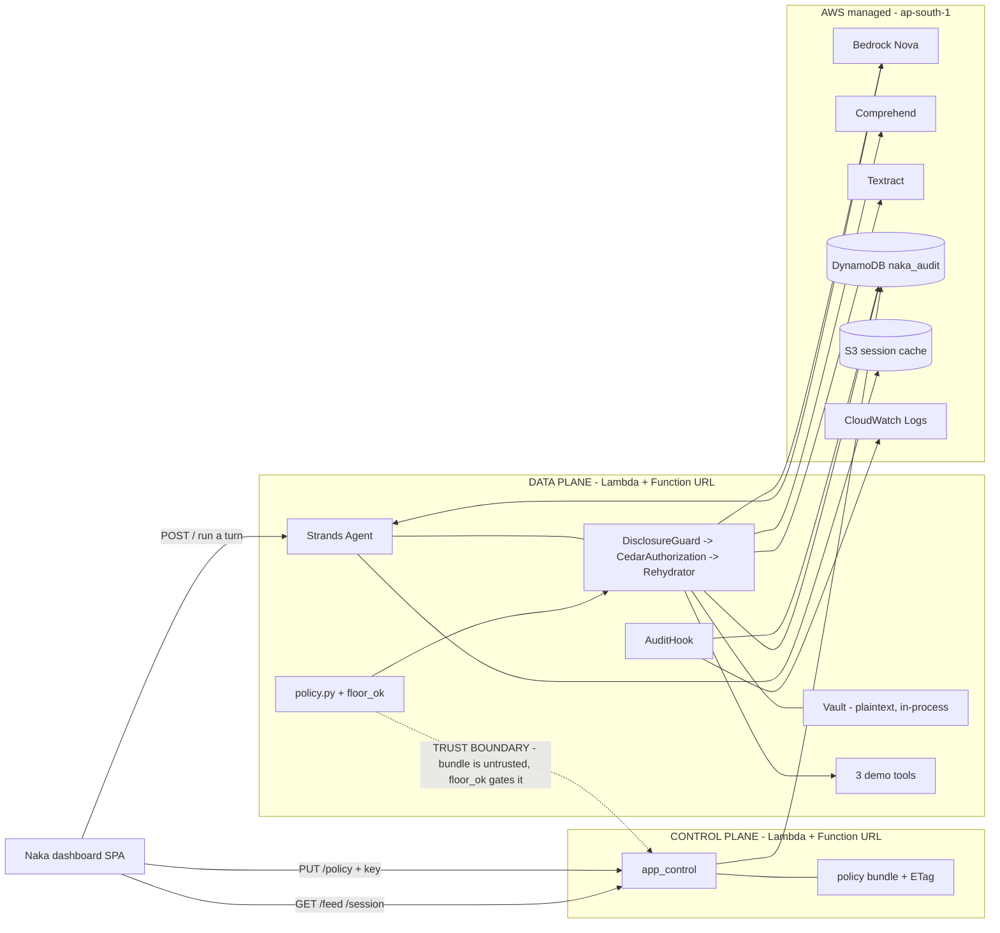

**Caption.** Both planes, every AWS service, and the one boundary that matters: the data plane treats the control plane's policy bundle as untrusted input and runs `floor_ok()` on it before loading, so an unauthenticated `PUT /policy` cannot lift the Aadhaar forbid or the budget ceiling. **Deliberately omitted:** intervention ordering (diagram 2), the fact that both Function URLs are `AuthType=NONE` and therefore have no principal boundary at all (diagram 10), and which Nova model runs where — the PRD puts Nova Lite on the agent loop and Nova Pro on tier 3 only, doc 08 puts Nova Pro on both, and that is unresolved (§13.7).

---

## 2. Per-tool-call sequence

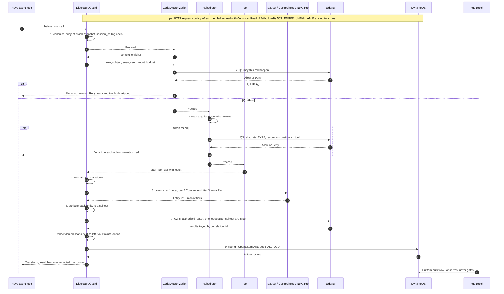

**Caption.** The full nine-step flow, both interventions and the hook. Two orderings are load-bearing and both are drawn: handlers run in registration order so a Q1 `Deny` skips the Rehydrator entirely (a denied call never gets plaintext substituted into its arguments), and the DynamoDB spend lands **before** the `Transform` releases content, so a crash between the two withholds rather than discloses. **Deliberately omitted:** retries and timeouts (diagram 9), the per-hop `asyncio.Lock` held across `detect → spend` for parallel tool use, and the enricher stash key `(tool_name, canonical_json(tool_input))` that makes parallelism safe. The `AuditHook` row is drawn as always written — see §13.6, which is not settled.

---

## 3. The file path

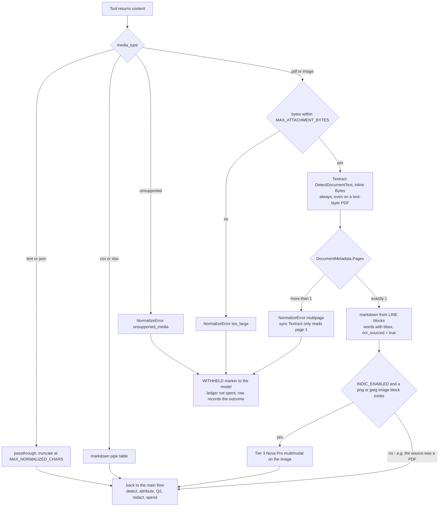

**Caption.** Everything becomes markdown before detection, which is what lets §8 have no per-format branching; the two decisions worth defending are that *every* PDF goes to Textract (a text-layer extractor silently misses a scanned Aadhaar embedded in a text-layer page — PRD §9.1) and that `Pages > 1` withholds the whole document rather than releasing page 1. **This diagram deliberately draws a hole rather than hiding it:** the `png or jpeg image block exists` branch. Bedrock's `ImageBlock.format` is `png|jpeg|gif|webp`, a PDF is none of those, and doc 08 §11 keeps a rasteriser out of the package — yet doc 08 §2.2 runs tier 3 on the PDF fixture and records `detector_tiers: [..., "indic"]`. See §13.4. **Omitted:** chunking of oversized markdown, and the EXIF/`docProps` metadata that markdown conversion discards rather than scans.

---

## 4. Detector tier decision tree

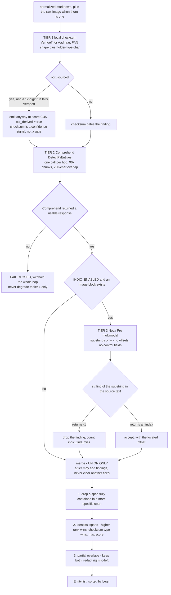

**Caption.** Cheapest tier first, but **not** short-circuiting — every available tier runs and the results union, because tier 3 reads attacker-supplied pixels with an instruction-following model and must never be able to clear another tier's finding. The `str.find` gate is the other half of that containment: a model-returned substring not literally present in the source is dropped, so a crafted document can cause a spurious redaction but never a silent pass. **Omitted:** Comprehend's per-chunk offset shift (the single most likely off-by-N in the build) and the `score >= COMPREHEND_MIN_SCORE` filter at 0.5. **Flagged, not settled:** the PRD's own §8 opening sentence calls the tiers "short-circuiting", which contradicts its closing composition rule; this diagram follows doc 08's run-all-then-merge (§13.8). Tier 1's `verhoeff_valid` is drawn without a provenance claim on purpose — see §13.1.

---

## 5. The two Cedar questions

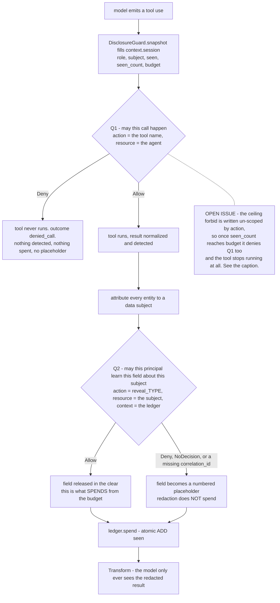

**Caption.** The two denies produce genuinely different outcomes and that is the point of the diagram: a Q1 deny means the tool never ran and nothing was learned, while a Q2 deny means the tool ran, the content was inspected, and one field came back as a reversible placeholder — so the task still completes. Note also that **only a revealed field spends**; redaction protecting a field must not also consume the budget that protected it. **The dashed node is a live defect, not decoration.** The ceiling rule is written `forbid(principal, action, resource) when { seen_count >= budget }` with no action scope, and the same enricher feeds `context.session` to both questions — so when the budget fills it denies the *call*, not just the *field*, and the demo's 1:10 beat has no result left to redact. Full argument in §13.2. **Omitted:** the Cedar text itself (doc 08 §3.4), and the `compliance` exemption, which interacts badly with the same rule (§13.3).

---

## 6. Disclosure ledger state

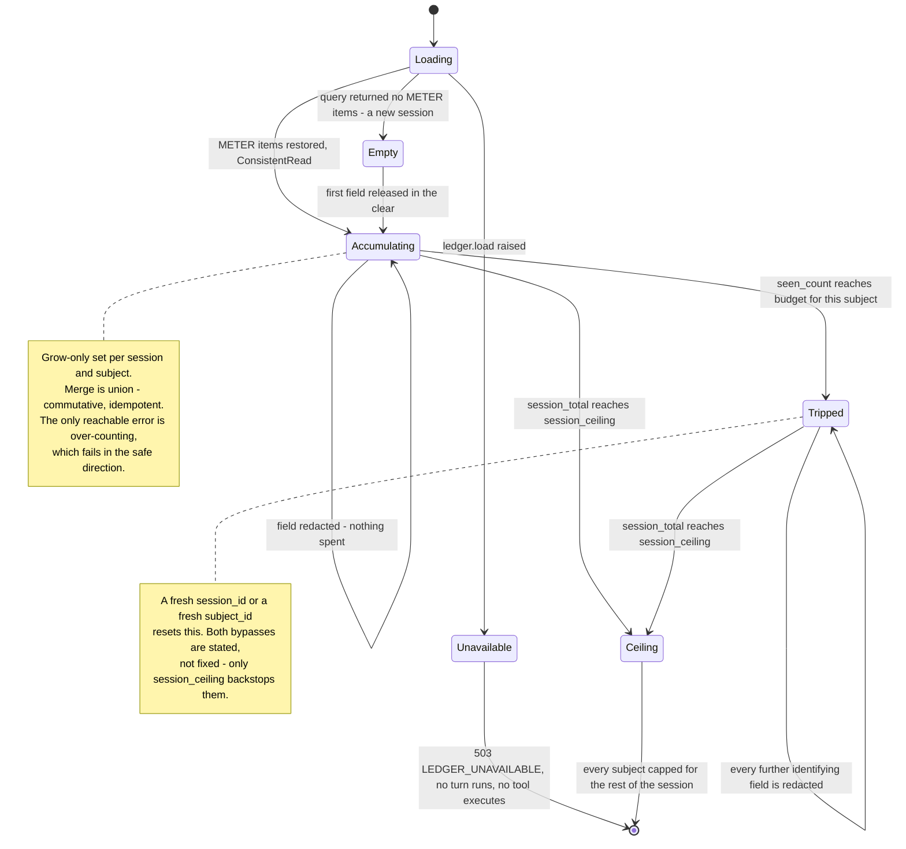

**Caption.** One meter per `(session_id, subject_id)`, filling by set union, tripping at `budget`, with `session_ceiling` as the cross-subject backstop against subject-id churn. `Loading → Unavailable` is drawn as a terminal state on purpose: an unreadable ledger that defaults to empty *is* the bypass, so the whole product is unavailable rather than degraded, and "new session" must be distinguishable from "store unavailable". **Deliberately omitted:** the `agent.state` cache copy in S3, which can lose an update and does not matter (union with the authoritative DynamoDB value repairs it), and the distributed race across concurrent Lambda invocations — the budget can be exceeded by one hop per concurrent invocation, which is accepted for the hackathon and closed in production by a `ConditionExpression` using DynamoDB's `size()` on the set.

---

## 7. Rehydration as a third Cedar question

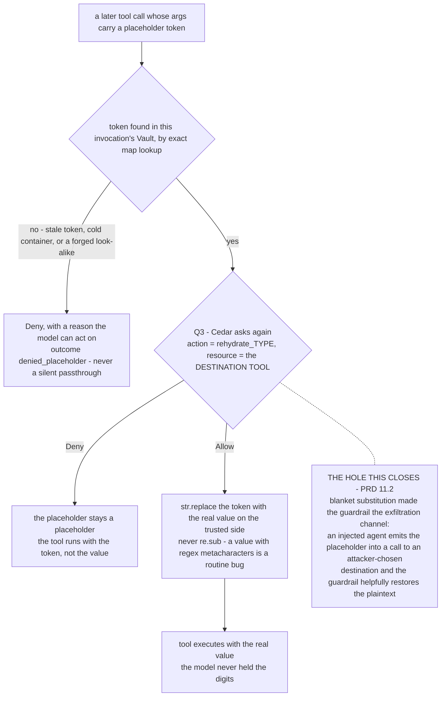

**Caption.** Without Q3 the guardrail is an exfiltration primitive — any authorized call carrying `[IN_AADHAAR_1]` gets the plaintext substituted, so a compromised agent just names an attacker-controlled destination and the guardrail helpfully restores the value. Making the **destination tool** the Cedar resource is the fix, and it is a Must (PRD §11 item 5), not a nice-to-have. The unknown-token branch is a `Deny` rather than a passthrough or a `Guide` for three separate reasons: a literal token reaching a downstream system gets stored as if it were an identifier, and a `Guide` invites the model to retry with the same unresolvable token. **Omitted:** the 4-hex per-invocation nonce inside every token (which is what stops a stale token rehydrating to a *different* person's Aadhaar), and the `finally: vault.clear()`.

---

## 8. Data model

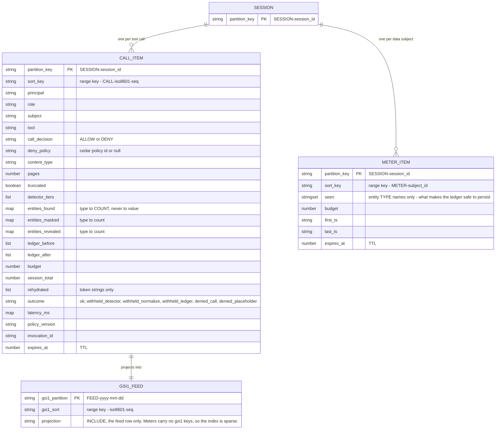

**Access patterns — every one maps to a query the dashboard actually issues**

| # | Dashboard need | Query | Index |
|---|---|---|---|
| 1 | Live decision feed, newest first, across sessions | `Query(gsi1pk="FEED#<date>", ScanIndexForward=False, Limit=50, ExclusiveStartKey=cursor)` | GSI1 |
| 2 | One session: all calls **and** all meters, one round trip | `Query(pk="SESSION#<id>")` | base |
| 3 | Disclosure meter for a session's subjects | #2's page, filtered on the `METER#` prefix client-side | base |
| 4 | Ledger load at agent init | `Query(pk="SESSION#<id>", sk begins_with "METER#", ConsistentRead=True)` | base |
| 5 | Drill into one call | already in #2's page — no extra query | base |
| 6 | Atomic spend | `UpdateItem(sk="METER#<subject>", "ADD seen :t", ReturnValues=ALL_OLD)` | base |

**Caption.** One on-demand table, two item shapes, one sparse GSI that exists for exactly one query (#1, which a base-table query cannot order and a scan cannot do cheaply). The structural safety property is visible in the attribute types: `entities_*` are type→**count** maps and `seen` is a set of type **names**, so there is no field in the schema capable of carrying a value — which is what makes the leak check in doc 08 §9.6 a two-line assertion. **Omitted:** Mermaid's ER notation has no vocabulary for a single-table design, so `SESSION` is drawn as a parent entity when it is really just a partition-key prefix, and `PK` markers stand in for DynamoDB's partition/sort split. TTL is 30 days as shipped; DPDP Rule 6's one year is the production setting, not this one.

---

## 9. Failure modes

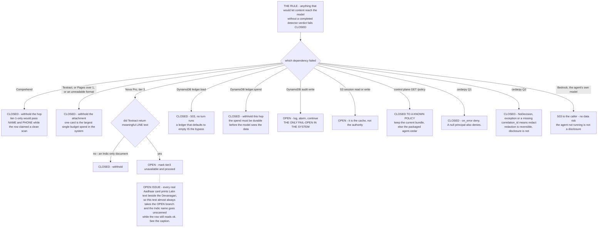

**Caption.** Doc 08 §5.1 as a tree, with the one intentional fail-open marked in caps: a failed audit write cannot cause a disclosure, only an unproven one, and withholding on a logging failure converts a telemetry outage into a product outage. **The dashed node is a second live defect.** The tier-3 direction is decided by "did Textract return meaningful `LINE` text" — but the demo artifact is an Aadhaar card, which by the project's own §8 argument prints the holder's name in Latin *beside* the regional script. Textract therefore always returns meaningful LINE text, the branch is always OPEN, and the Devanagari name is released unscanned while `outcome` still reads `ok`. See §13.5. **Omitted:** exact timeouts and retry counts (doc 08 §8), and the `WITHHELD` marker text handed back to the model.

---

## 10. Threat model and trust boundaries

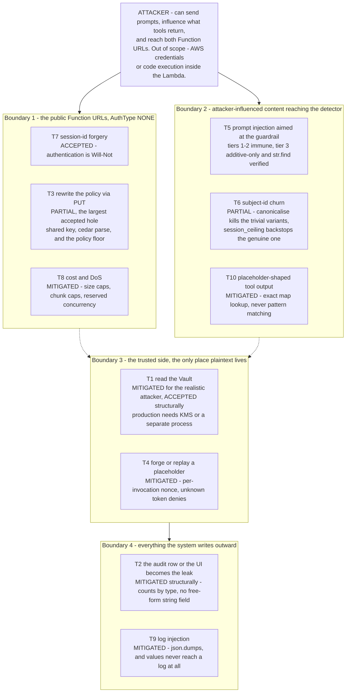

**Caption.** Doc 08 §7's ten threats grouped by the boundary each one attacks, with status kept on the node so the accepted holes are as visible as the mitigated ones — T3 (an unauthenticated `PUT /policy` behind a shared secret and a substring-matched policy floor) and T7 (a caller-chosen `session_id`) are the two a judge is most likely to reach for, and both are named in the writeup before anyone else names them. **Deliberately omitted:** an attacker with AWS credentials or code execution inside the Lambda — that is a total compromise of a system with no isolation boundary inside it, and pretending otherwise would be dishonest. The dashed edges into Boundary 3 mean "can influence, cannot read".

---

## 11. Deploy pipeline

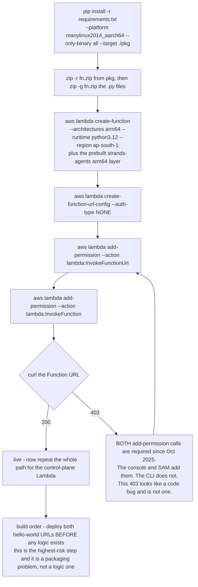

**Caption.** Plain zip and CLI, no CDK, with the failure loop drawn explicitly because it is the one the PRD flags as costing the Ship It prize: since October 2025 a new Function URL needs **both** `lambda:InvokeFunctionUrl` and `lambda:InvokeFunction`, the console and SAM add them silently, the CLI does not, and the resulting 403 reads exactly like a code bug. `cedarpy` 4.12.0 ships the `manylinux2014_aarch64` wheel with no abi3, which is why Python is pinned to 3.12. **Omitted:** IAM role and policy creation, DynamoDB table and S3 bucket creation, CORS configuration (set on the Function URL, never emitted from the handler, or the browser sees duplicate `Access-Control-Allow-Origin` headers), and environment variables.

---

## 12. The demo timeline

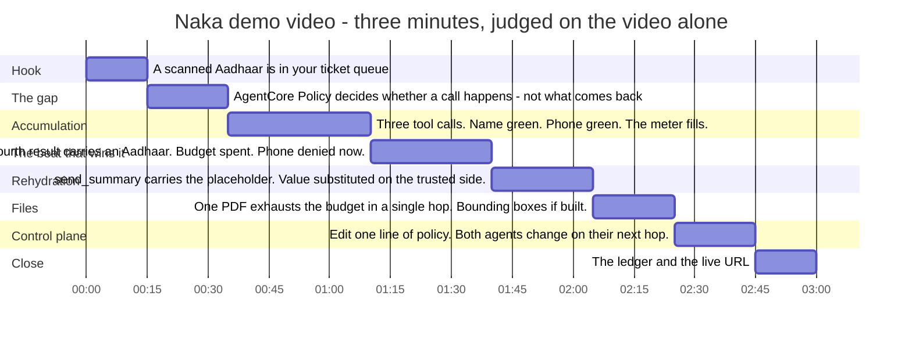

**Caption.** PRD §12's beats at true scale, so the team can see that accumulation plus the reversal is 65 of the 180 seconds and everything else is 15–25. Judges see only the submitted video, so a feature described in the writeup and absent here does not count. **Omitted:** narration wording, which matters more than the pacing — say "removed from context going forward", never "the model no longer knows it", because the model read it and the imprecise version dies in one sentence. **Note the dependency:** the 1:10 beat requires the fourth tool call to *run* and be redacted; §13.2 says that as the policy is currently written it will be denied at Q1 instead, and the shot will not exist.

---

## 13. What drawing these revealed

Ten findings, ordered by how much they cost if nobody looks. The first two are the ones to fix tonight.

**13.1 — Verhoeff provenance is a direct contradiction, and one side of it says "disqualification".** PRD §8: *"Write Verhoeff fresh from the published D₅ dihedral-group tables. Do not copy the implementation that exists elsewhere on this machine — the hackathon requires new work created during the event, and copied code with mismatched provenance disqualifies the whole team."* Doc 08 §1.3: *"`verhoeff_valid` is not new code — `detection-engine/recognizers/checksums.py` in this repo already has a correct, table-driven, unit-tested Verhoeff. Copy that function and its two tables verbatim."* Doc 08 §9.1 repeats it. These cannot both be followed. Diagram 4 draws the tier without a provenance claim because there is no correct answer to draw. **Decide before writing a line of `detect.py`** — it is twenty lines either way, and only one of the two options carries a team-wide disqualification risk.

**13.2 — The ceiling `forbid` is un-scoped by action, so it denies Q1, and the money shot of the demo cannot happen.** The rule is `forbid(principal, action, resource) when { context.session has seen_count && context.session.seen_count >= context.session.budget }`. `CedarAuthorization` evaluates Q1 against the *same* `context.session` the enricher builds, which carries `seen_count` and `budget`. So the instant a subject's meter fills, the next `fetch_customer` on that subject is denied outright — the tool never runs, nothing is detected, and there is no result to redact. PRD §12's 1:10 beat ("it redacts — **and the phone number, which was allowed at call two, is denied now**") requires exactly the opposite. Three things make this worse than a typo: doc 08 §9.5 encodes the behaviour as a *passing* assertion (`seen_count = 3, budget = 3 → Deny on any action`), the rule's text is one of the two strings in `FLOOR_RULES` so it cannot be removed or edited at runtime, and the policy floor is a substring check so the fix has to change the floor too. **Fix:** scope the ceiling to the reveal actions — `forbid(principal, action in [Action::"reveal_NAME", ...], resource) when {...}` — and update `FLOOR_RULES` to match.

**13.3 — The same rule breaks the compliance exemption, and doc 08 says it doesn't.** Cedar `forbid` always beats `permit`. Doc 08 §9.5 asserts `role="compliance"` allows everything and explains that this works because "the policy must scope the forbids on `role == "analyst"`, which is exactly how §3.4 writes them". It is not: the ceiling forbid in §3.4 is scoped on `seen_count`/`budget` only, with no role condition. The compliance permit cannot override it. What actually saves the case is `budget_per_role: {"compliance": 9999}` making the condition unreachable — a configuration accident doing a policy's job. Scoping the ceiling on `role == "analyst"` fixes 13.2 and 13.3 in one edit.

**13.4 — Tier 3 cannot run on the demo's own fixture.** The headline artifact is a single-page scanned Aadhaar **PDF** (`read_attachment` → `aadhaar.pdf`). Tier 3 sends a Bedrock `ImageBlock`, whose `format` is `png | jpeg | gif | webp` — doc 08 §1.3 says so explicitly and adds "convert anything else before sending". Nothing in the package converts: §11 keeps `pypdf` and every other PDF library out ("Textract does the PDF work"), and Textract returns text and bounding boxes, not a raster. Yet doc 08 §2.2 step 16 runs tier 3 on that PDF and step 20 records `detector_tiers: ["checksum","comprehend","indic"]`. Either the demo fixture becomes a PNG or something has to rasterise. A PNG fixture is the lazy fix and costs nothing.

**13.5 — The tier-3 fail-closed test never fires on a real Aadhaar card.** Doc 08 §5.1 routes a tier-3 failure as *"CLOSED if the document is Indic-only; OPEN (degrade) if tiers 1–2 already covered it"*, distinguished by "whether Textract returned meaningful `LINE` text". But the entire §8 differentiator is that an Aadhaar card prints the holder's name in regional script **beside the English** — so Textract always returns meaningful LINE text, the test always takes the OPEN branch, and the Devanagari name is released unscanned while the audit row reads `outcome: ok`. §7 threat 5's `tier3_unverified` marker exists but does not change `outcome`, so §10.4's "unscanned egress events must be exactly zero" counter will not see it either. **Fix:** make `tier3_unverified` a non-`ok` outcome, or redact the tier-3 region when the tier was expected and unavailable.

**13.6 — The two deny outcomes may never produce an audit row.** `AuditRow.outcome` includes `denied_call` and `denied_placeholder`, and doc 08 §5.3 says a denied placeholder has "the audit row written". But `AuditHook` registers on **`AfterToolCallEvent` only**, and both denies happen at `before_tool_call`, where the tool does not run. Doc 08 §12 lists `AfterToolCallEvent`'s behaviour in this case among the things *not established by the docs reviewed*. If the event does not fire on a denied call, the visible deny path (Must #3) writes nothing to the live feed and the two outcome values are unreachable.

**Now addressed in the PRD:** §10 requires `AuditHook` to bind **both** `BeforeToolCallEvent` and `AfterToolCallEvent`, and Must #9 says so. A denial is exactly the evidence the audit trail exists to produce, so an after-only hook was omitting the most important rows. Still worth the five-minute confirmation on Saturday: deny one call, check a row lands, and check it is distinguishable from a completed one.

**13.7 — RESOLVED.** Doc 08's `build_agent` and `MODEL_ID` default now match the PRD: `apac.amazon.nova-lite-v1:0` on the loop, Nova Pro reserved for tier 3. The demo prices at ~$2.25/month on that basis. Diagram 1 still says "Bedrock Nova" generically, which remains correct since both models are in play.

**13.8 — "Short-circuiting" and "union" are the same paragraph contradicting itself.** PRD §8 opens *"Three tiers, cheapest first, short-circuiting"* and closes *"tiers UNION, they never subtract. A tier may only ever add findings."* Doc 08 implements run-all-then-merge, which is the only version compatible with the tier-3 containment argument. Strike "short-circuiting" from the PRD before it reaches the writeup — a judge who notices will read it as the detector being described by someone who did not build it.

**13.9 — RESOLVED.** PRD §11's Must list has been renumbered (it had two consecutive items numbered "6"); the ledger item is now **Must #6** and states DynamoDB authority rather than S3. The Chowki→Naka rename has reached all identifiers — `naka/`, `naka_audit`, `X-Naka-Key`, `NAKA_KEY`. Only the folder and filenames retain the old spelling, deliberately.

**13.10 — One thing drawing confirmed rather than broke.** The ordering in diagram 2 — spend durable in DynamoDB *before* `Transform` releases content, and `Rehydrator` registered third so a Q1 `Deny` skips it — is the only arrangement in which no single-step failure discloses. Every other permutation leaks on some crash. It is worth saying out loud in the writeup, because it looks arbitrary and is not.
